<div align="center">

# Cadence

### Keep useful work inside the latency budget.

**An SLO-aware LLM inference gateway with continuous batching, paged KV,
prefix reuse, and conformal admission control.**

[](https://github.com/BAAAAR19/Cadence/actions/workflows/ci.yml)


[Quick start](#quick-start) · [The ablation ladder](#the-ablation-ladder-1) · [Methodology](#methodology) · [Admission control](#week-4-predicting-latency-and-refusing-work-on-a-guarantee) · [Deploy](deploy/README.md) · [Five-minute demo](docs/demo.md)

</div>

> **Status: complete.** Weeks 0–5: the OpenAI-compatible streaming gateway,
> the open-loop measurement harness, the systems core (iteration-level
> scheduling, paged KV, radix prefix cache, metrics and tracing), the C++17
> port of the two KV data structures behind pybind11, the latency predictor
> with split-conformal admission control, and the five-rung ablation with
> three seeds, a CI load gate that has been shown to go red, and a
> deployable image. See [Roadmap](#roadmap).
>
> **The headline, from the five-rung ladder: at 4 rps — 2.9× the offered load
> at which this system's goodput peaks without admission control — the
> conformal controller holds p99 end-to-end at 2.3 s against a 4 s SLO and
> delivers 1.62 rps of goodput, where the same system without it is at 90.0 s
> and delivers nothing inside the SLO at all.** Every request it admitted
> finished inside the budget, at every offered load in the grid. Across the
> ladder, goodput at the SLO rises 4.6× from FIFO to rung 5 and p99 past
> saturation falls from 300 s to 3.8 s.
>
> Each of those numbers is the mean of three seeds with the range reported
> beside it, from 144 runs over ten hours, interleaved rate-major with the
> rung order rotated and a thermal probe taken before every single run. See
> [Week 5](#week-5-the-ladder-three-seeds-and-a-gate-that-can-fail).
>
> **Week 5's most useful findings are again failures.** A 99% per-request
> guarantee is unattainable against this SLO and the honest bound says so by
> refusing 100% of arrivals at an idle engine — reproduced here on three
> seeds. A conformal bound carried to hardware it was not calibrated on is
> not conservative but arbitrary, which was discovered the hard way and is
> now checked at start-up. And the thermal probe itself has a defect, named
> in [its own table](#was-the-machine-the-same-machine) rather than
> smoothed over.
>
> Week 3's headline is a negative result, reported as one: the profile says
> the two structures are **0.02% of scheduler-thread time**, the port is a
> 2.1× microbenchmark win and a 0% end-to-end win, and what it actually bought
> was a latent admission bug that had been crashing nothing only because no
> measured configuration reached the pressure it needs. See
> [Week 3](#week-3-the-c17-core-and-what-it-was-actually-worth).


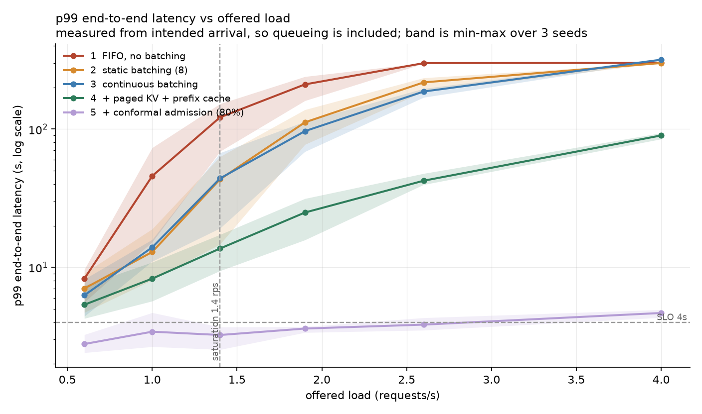

*Five rungs, three seeds each, shaded min-max. x is **offered** load, not
achieved throughput — achieved throughput saturates, which folds the entire
overload region into one point at the right-hand edge. y is log, because the
rungs differ by two orders of magnitude past the knee. The dashed lines are
the SLO and the measured saturation point.*

---

## The three claims, and where each is defended

| Claim | Evidence | Status |
|---|---|---|
| **Iteration-level scheduling and prompt reuse move the collapse point 2.8× further out.** | Goodput at a 4 s SLO rises 0.44 → 1.23 rps across rungs 1–4 of the five-rung ladder: 90 runs, three seeds each, one interleaved sweep, rate-major with the rung order rotated. Adding admission control takes it to 2.02 rps, a 4.6× total. | **Measured** |
| **The measurements are sound.** | Open-loop Poisson generator built before the scheduler, latency timestamped from *intended* arrival, arrival process KS-validated over 200 seeds and each of the three sweep seeds recorded *before* the run rather than chosen after it, goodput reported alongside throughput — with the finding that throughput cannot distinguish the rungs at all. A fixed probe before each of the 144 runs says the machine's speed varied 21.9% across the sweep but only 5.7% between rung means, and rung 4 was run twice in two blocks to put a number on what the second block cost. | **Measured** |
| **My scheduler holds p99 under overload.** | True, and measured on three seeds: at a 95% per-request guarantee, p99 end-to-end stays between **1.6 s and 2.3 s across the whole 0.6–4.0 rps grid**, ending at 2.3 s where the same system without admission control reaches 90.0 s and serves nothing inside the SLO. **100% of admitted requests met the budget at every offered load.** The bound's coverage is validated on a held-out split at four levels and again online. The cost is in the same table and it is large: at 4 rps the controller refuses 59% of arrivals, below saturation it refuses work that would have made it, and a 99% guarantee against this SLO is unattainable — that arm refuses everything. | **Measured** |
| **My C++ is load-bearing, not decorative.** | It is not load-bearing, and that is the measured answer rather than the hoped-for one: the profile puts the allocator and the radix cache at 0.02% of scheduler-thread time, the port is 2.1× on the microbenchmark and 0% end to end, and the arithmetic said so before the run did. The port earned its place on correctness instead — it surfaced a use-after-free in the Python version, and it is held to the reference by a differential fuzz over 5 000 random operation sequences. | **Measured** |

The third row is the one the project exists for, and it is worth reading with
its second half attached: the guarantee is real, it is verified rather than
assumed, and it is bought with refused work. The fourth row is the one most
likely to be overclaimed in a portfolio, so it is stated the way the
measurement came out.

---

## Quick start

```bash
git clone https://github.com/BAAAAR19/Cadence.git && cd Cadence
uv sync --all-groups          # also builds the C++17 KV core; needs CMake >= 3.26
mkdir -p models && hf download Qwen/Qwen2.5-0.5B-Instruct-GGUF \
    qwen2.5-0.5b-instruct-q4_k_m.gguf --local-dir models
uv run cadence-serve
```

There is no separate build step and no committed binary: the project's build
backend is scikit-build-core, so installing it compiles `cadence._core`. If it
is not built, the gateway falls back to the Python reference and says so in
`/stats`; `CADENCE_KV_CORE=python|cpp` pins one explicitly, and asking for
`cpp` when it is missing is an error rather than a silent downgrade — a
benchmark that thinks it measured the extension and quietly measured Python is
worse than a benchmark that failed.

Then, with no code changes on the client side:

```python
from openai import OpenAI
client = OpenAI(base_url="http://localhost:8000/v1", api_key="not-needed")
for chunk in client.chat.completions.create(
        model="qwen", messages=[{"role": "user", "content": "hello"}], stream=True):
    print(chunk.choices[0].delta.content or "", end="")
```

Observability:

```bash
docker compose -f deploy/docker-compose.yml up --build
# Grafana on :3000 with the Cadence dashboard provisioned, Prometheus on :9090
```

> **Verified so far:** the compose file, Prometheus config, OTel collector
> config, Grafana provisioning and the dashboard JSON are committed and
> schema-checked in CI, and the gateway's `/metrics` and OTLP export are
> covered by tests. The stack has **not** been brought up end to end — Docker
> is not installed on the machine these measurements were taken on. Treating
> "the YAML parses" as "the dashboard works" is exactly the kind of claim this
> project is trying not to make, so it is flagged rather than implied. Note
> also that the container builds `llama-cpp-python` for CPU: there is no Metal
> inside Docker on macOS, so containerised throughput is well below the host
> numbers reported here.

Reproduce the measurements:

```bash
./bench/run_ablation.sh
```

Reproduce Week 3's — profile, microbenchmark, end-to-end A/B, in that order,
because that is the order the argument has to be made in:

```bash
./bench/run_week3.sh
```

Reproduce Week 4's — collect traces with admission off, fit and calibrate the
predictor, then run the two-arm sweep that uses it. The order is forced by the
method: the model may only see traces that no arm of the comparison produced.

```bash
./bench/run_week4.sh
```

---

## Architecture

```
                 OPEN-LOOP LOAD GENERATOR (Poisson arrivals, fixed rate)
                                  |
                                  v
      +---------------------------------------------------------------+
      | FastAPI /v1/chat/completions (SSE streaming)                    |
      +---------------------------------------------------------------+
                                  |
                     [ 1 ] ADMISSION CONTROLLER
                     features -> quantile regressor -> conformal bound U(x)
                     admit if U(x) <= SLO, else 503 + Retry-After
                                  |
                                  v
                     [ 2 ] WAIT QUEUE (priority = deadline)
                                  |
                                  v
      +---------------------------------------------------------------+
      | [ 3 ] CONTINUOUS-BATCHING SCHEDULER                             |
      |   every step: admit new / chunk prefill / evict / decode        |
      +---------------------------------------------------------------+
           |                        |                       |
           v                        v                       v
  [ 4 ] PAGED KV CACHE     [ 5 ] RADIX PREFIX CACHE   [ 6 ] MODEL RUNNER
  block allocator          shared-prompt reuse         llama.cpp, in-process
  C++17 via pybind11       C++17 via pybind11          llama_decode
           |                        |                       |
           +------------------------+-----------------------+
                                  |
                     Prometheus / OpenTelemetry
                     TTFT, ITL, E2E, queue depth, goodput
```

The scheduler runs on its own thread. `prefill` and `decode_step` are
synchronous and compute-bound, and calling them on the API event loop blocks
every SSE writer — which corrupts inter-token-latency measurements at exactly
the millisecond scale this project measures at. Requests cross into the engine
through a lock-protected deque; tokens cross back out through
`loop.call_soon_threadsafe`.

---

## Why a 0.5B model

Not a compromise — the correct choice for what is being benchmarked. Cadence is
a **scheduler**, and a large model would make model time dominate every
scheduling decision, mask the effect of each policy, and turn a five-minute
experiment into an hour-long one. Qwen2.5-0.5B-Instruct at Q4\_K\_M decodes fast
enough that the scheduler is the bottleneck, and it is instruction-tuned, so
response lengths have a realistic distribution.

The consequence is stated rather than hidden: absolute throughput here is a
property of an M-series laptop and a 0.5B model, and only the *relative*
differences between configurations transfer.

---

## Methodology

### Open loop, and why it is not negotiable

A closed-loop generator — N workers, each waiting for its response before
sending the next — makes offered load a *consequence* of server speed. When the
server slows, the client slows with it, the queue never builds, and overload
behaviour cannot be observed at all. Since overload behaviour is the entire
subject of this project, that harness would answer the wrong question.

Cadence's generator (`bench/loadgen.py`) has three properties, each of which is
tested:

1. **Arrivals are exponential**, not fixed-interval. Fixed intervals understate
   queueing. The realised inter-arrival distribution is KS-tested against
   `Exp(λ)` on every run and the p-value is recorded in the parquet.
2. **Every latency is measured from the intended arrival time**, never the
   actual send time. This is what kills coordinated omission: in a closed loop
   the requests that *would* have been slowest are never issued, so the
   measured tail is optimistic by an order of magnitude.
3. **An outstanding request never delays the next arrival.** The connection
   pool is unbounded on purpose — a pool limit is backpressure, and backpressure
   turns the harness back into a closed loop.

#### The seed is fixed in advance, and it landed in the tail

Every rung replays the **same** arrival sequence (seed 0), because a comparison
between rungs is only a comparison if the thing offered to them is identical.
The cost of choosing the seed before seeing the data is that the seed can land
in the tail of the KS distribution, and this one did: seed 0's realisation is
rejected at α=0.05 at every rate in the sweep.

Those are not six independent failures. The KS statistic for an exponential fit
depends only on the underlying uniform draws, so the six rates are nested
prefixes of one sequence — one draw, reported six times.

`bench/validate_loadgen.py` establishes the process itself over 200 seeds in
exactly the regime the sweep runs in (180 s at 1.4 rps, gaps interleaved with
workload sampling from the same RNG), and commits the result to
`results/loadgen_validation.json`:

| Quantity | Measured | Expected |
|---|---|---|
| KS rejection rate at α=0.05 | 7.5% | ~5% |
| Median KS p-value | 0.478 | 0.5 |
| Mean arrivals per run | 253.8 | 252 |
| SD of arrivals per run | 17.2 | 15.9 |
| Percentile of seed 0's p-value | 1.5th | — |

So the arrival process is exponential and seed 0 is a draw from its tail. The
alternative — re-rolling the seed until the p-value looks better — is exactly
the selection that would make the statistic meaningless, so it is reported
rather than fixed.

The generator was also validated against a model-free stub before it was ever
pointed at the gateway (`bench/stub_server.py`):

| Check | Result |
|---|---|
| λ=5 rps for 60 s against a `sleep(0.1)` stub | 341 requests, near-zero queueing |
| Arrival process over 300 seeds | mean 301.5 arrivals (Poisson expects 300, σ≈17), KS rejection rate 7% at α=0.05, p-values ≈ uniform |
| λ=20 rps against a stub that can only do 10 rps | median E2E 8.4 s → 25.4 s → 41.9 s → 57.9 s over four 15 s windows — growing without bound, as an open loop must |

That last row is the one that matters. A closed-loop harness plateaus there.

### Metric definitions

| Metric | Definition | Why this one |
|---|---|---|
| TTFT | intended arrival → first content token | includes queueing; what a user perceives as "did it start" |
| ITL | gap between consecutive content tokens | streaming smoothness; p99 ITL exposes batch-step stalls |
| E2E | intended arrival → last token | the SLO variable |
| Throughput | completed requests/s | capacity |
| **Goodput** | requests/s completing **within** the SLO | the only number that matters under overload |
| Shed rate | fraction returned 503 | cost of admission control |

Goodput is the headline. A gateway serving 40 rps with a 12 s p99 against a 2 s
SLO has a goodput of nearly zero; one serving 22 rps within SLO and shedding
the rest has a goodput of 22. That framing is what makes admission control
obviously correct rather than obviously lossy — and it is the objective Week 4
optimises directly.

### The workload

70% of requests share one of four long, realistic system prompts (~480–650
tokens); 30% carry a unique system prompt of comparable length, so the only
difference between the two populations is *shareability*, not size. Output
lengths are lognormal(4.6, 0.8), clipped to [16, 512].

The heavy tail is the point. With fixed-length outputs every scheduling policy
looks identical, latency prediction is trivial, and there is nothing to build.
A lognormal tail creates head-of-line blocking, makes continuous batching pay
off visibly, and gives the Week 4 predictor something real to be uncertain
about. A `uniform` workload is included precisely to demonstrate that — see
[Negative results](#negative-results-and-limitations).

### The sweep grid and the SLO were measured, not guessed

The build guide's example sweep runs 1–16 rps. On this machine that grid would
consist entirely of points past collapse. `bench/calibrate.py` measures the
machine first and commits its output to `results/calibration.json`:

| Quantity | Measured |
|---|---|
| Prompt length | p50 541, p95 639, max 648 tokens |
| Requested output length | p50 100, mean 136, p95 380 tokens |
| Prefill | 1 641 tok/s |
| Decode, batch 1 | 81.5 tok/s (12.3 ms/step) |
| Decode, batch 4 | 205.3 tok/s aggregate (19.5 ms/step) |
| Decode, batch 8 | 205.8 tok/s aggregate (38.9 ms/step) |
| Decode, batch 16 | 314.6 tok/s aggregate (50.9 ms/step) |
| KV cache | 16 384 cells, unified across sequences |
| Implied FIFO capacity | ≈ 0.50 rps |
| Implied best-case batched capacity | ≈ 1.31 rps |
| Implied unloaded E2E | p50 1.56 s, p95 5.00 s |

Three things follow, and all are load-bearing for reading the results.

**The sweep runs 0.3–2.6 rps**, which brackets the knee of every rung: FIFO
saturates near 0.5, continuous batching near 1.3, and continuous batching with
a warm prefix cache near 2.2.

**The KV pool is 16 384 cells, not 8 192.** This was found the hard way. At
8 192, a batch of ten ~540-token prompts plus their generation occupies the
whole pool, so every admission evicted a cached prefix and the measured prefix
hit rate was 10% — a number that described the cache's eviction rate and
nothing else. The pool has to be large enough for the thing being measured to
exist. At 16 384 cells (192 MiB of KV, still half the model's 32 768-token
training context) the hit rate settles at ~0.61 against a theoretical ceiling
of ~0.64, and p50 end-to-end latency at 1.0 rps falls from 3.95 s to 1.17 s.

**The SLO is 4.0 s**, not the guide's 2.0 s. Implied unloaded end-to-end
latency is p50 1.56 s and p95 5.00 s, so a 2 s target would be unattainable for
most requests at *zero* load: it would measure the output-length distribution,
not the scheduler. Against the measured output-length distribution, 4.0 s is
attainable for roughly 90% of requests on an idle server and is comfortably
violated under overload — which is what a useful SLO looks like: it is the
*scheduler* that decides whether it is met, not the draw of the output length.
Because the choice is a choice, `bench/analyze.py --slo` recomputes goodput at
any target from the same raw records, and an SLO-sensitivity table is published
alongside the headline numbers.

### What the source was, when

Every number in the ladder comes from one engine source revision, recorded as
`results/src.hash` and checked before the sweep started. Three defensive
changes landed afterwards, while analysing the results:

* `Settings` now refuses a prefill budget larger than `n_batch` at startup
  (it previously overran the pre-allocated `llama_batch` and failed every
  request with no indication why — found while setting up the chunked-prefill
  experiment);
* `prefill_chunk` caps the per-call token count at `n_batch` as a second line
  of defence;
* `BlockManager.can_append` now accounts for the free block a shared block's
  copy-on-write will need — found by the Hypothesis property test on a new
  draw.

All three are no-ops for the ladder's configuration, but "should be a no-op" is
not a measurement. Re-running `continuous+cache` at 1.0 rps on the changed
source reproduces the recorded point within run-to-run noise:

| | goodput | SLO met | TTFT p50 | ITL p99 | E2E p50 | E2E p99 | prefix hit |
|---|---|---|---|---|---|---|---|
| recorded | 1.098 | 0.890 | 0.067 | 0.336 | 1.223 | 8.313 | 0.621 |
| re-run | 1.078 | 0.874 | 0.071 | 0.361 | 1.317 | 8.465 | 0.626 |
| delta | −1.9% | −1.9% | +5.1% | +7.5% | +7.7% | +1.8% | +0.5% |

Week 3 changed the engine source again, in four places that could in principle
move a number:

* `ContinuousScheduler._pinned_match` holds a matched prefix for the length of
  the admission decision, fixing a crash under memory pressure (described in
  [Week 3](#week-3-the-c17-core-and-what-it-was-actually-worth));
* `RadixCache` uses a logical clock rather than `time.monotonic()` for LRU
  ordering — identical ordering, and the only version of the rule two
  implementations can be asked to agree on;
* `RadixCache.match` no longer slices the prompt on every node it visits, which
  removes the lookup's only super-linear term;
* the C++ core became the default when it is built.

The same protocol applies: the A/B's `kv-core-python` arm at 1.0 rps *is* the
re-verification, on source that differs from the ladder's in all four ways, and
it lands on the recorded point. `results/src.hash` is now produced by
`bench/srchash.py` and stamped into every run's `meta.json`, so this check is a
function rather than a note. The Week 2 value in that file was computed by
hand; the runs it labels are unchanged.

Week 4 changed the engine source again, and this time one of the changes is
not a no-op for anything measured before it: `Engine.start()` now runs a
four-token generation through the scheduler before the server accepts traffic.
It exists because the admission controller's features include EWMAs of step
latency and token rate, and an engine that has never stepped reports both as
zero — a state the training set never contains. What that did to a live
gateway is written up in
[Week 4](#week-4-predicting-latency-and-refusing-work-on-a-guarantee); the
consequence for the earlier numbers is that a run now starts with the model
warm rather than paying for the first forward pass inside its first measured
request. The benchmark harness already sent a warm-up request of its own for
that reason, so the ladder's numbers are unaffected — but the two now overlap,
and the harness's one is the redundant one.

The rest of the Week 4 changes are additive: the `admission/` package, a
snapshot of scheduler state that nothing else reads, and the trace writer,
which is inert unless `CADENCE_TRACE_LOG` is set. The Week 4 sweep's own
fingerprint is `results/src.w4.hash`, stamped into
`results/w4_admission/meta.json` like every other run's.

### One run was repeated, and it is marked as such

The `fifo` run at 2.6 rps completed but its parquet write failed: the `status`
column mixed integer HTTP codes with the string `'ReadTimeout'`, which only
happens at an overload severe enough for requests to hit the client's 300 s
timeout, and pyarrow refused the frame. The run was repeated twelve hours later
on byte-identical engine source and reproduced the lost one closely (p50
196.9 s vs 194.9 s, p99 301.5 s vs 301.3 s, 329 vs 337 completions). The merge
is recorded in `results/w2_ladder/meta.json`. The underlying bug is fixed —
`status` is now a nullable integer and transport failures go in a separate
`error` column — and a failed write no longer aborts the remaining rungs.

### Two trace blocks were re-collected, and they are marked as such

The Week 4 training set is 28 blocks of load, collected over 39 minutes. Two of
them — round 1 at 1.6 and 2.0 rps — ran while a full `pytest` suite was
started on the same laptop, which is exactly the background-process
contamination the protocol below is supposed to prevent. It is visible in the
result: p50 end-to-end at 1.6 rps came out at 2.65 s against 1.75 s for the
same offered load in the round before it.

Both blocks were re-collected on a quiet machine under their original names and
their original arrival seeds (p50 1.28 s and 5.18 s), and the contaminated
originals are kept in `results/w4_traces/contaminated/` rather than deleted: a
discarded measurement nobody can see is indistinguishable from one that was
never taken. `bench/traces.py` excludes that directory by name.

### Guarding against thermal drift

Running every rate of rung 1, then every rate of rung 2, measures the later
rungs on a hotter laptop — and biases in the direction that flatters exactly
the configurations this project argues for. `bench/run_ladder.py` is therefore
**rate-major with rotated rung order**, and it restarts the gateway for every
(rung, rate) pair so no configuration inherits another's warm prefix cache.

---

## Results

*Generated by `bench/make_report.py` from the committed parquet in
`results/w2_ladder/`. Figures by `bench/charts.py`.*

### The ablation ladder

Each rung adds exactly one thing to the rung above it, so each row is
attributable. Same workload, same arrival sequence, same seed, same duration;
rate-major with rotated rung order.

<!-- LADDER -->

| Config                       |   Peak goodput (rps, SLO 4s) |   at offered (rps) |   p50 TTFT (s) |   p99 TTFT (s) | p99 E2E past saturation (s)   |   p99 ITL (s) | Prefix hit rate   |
|:-----------------------------|-----------------------------:|-------------------:|---------------:|---------------:|:------------------------------|--------------:|:------------------|
| 1  FIFO, no batching         |                         0.37 |                0.6 |           3.23 |           9.88 | 155 @ 1.4 rps                 |         0.015 | n/a               |
| 2  Static batching (8)       |                         0.55 |                0.6 |           1.11 |           4.51 | 51 @ 1.4 rps                  |         0.031 | n/a               |
| 3  Continuous batching       |                         0.78 |                1   |           0.44 |           1.68 | 173 @ 2.6 rps                 |         0.378 | n/a               |
| 4  + paged KV + prefix cache |                         1.19 |                1.4 |           0.1  |           0.91 | 33 @ 2.6 rps                  |         0.366 | 65%               |

<!-- /LADDER -->

**Goodput at the SLO rises 3.2× from rung 1 to rung 4, and p50 TTFT falls 32×.**
Every rung earns its place: batching at all (rung 2) buys 1.5×, making that
batching iteration-level (rung 3) buys another 1.4×, and reusing the shared
system prompt (rung 4) buys a further 1.5×.

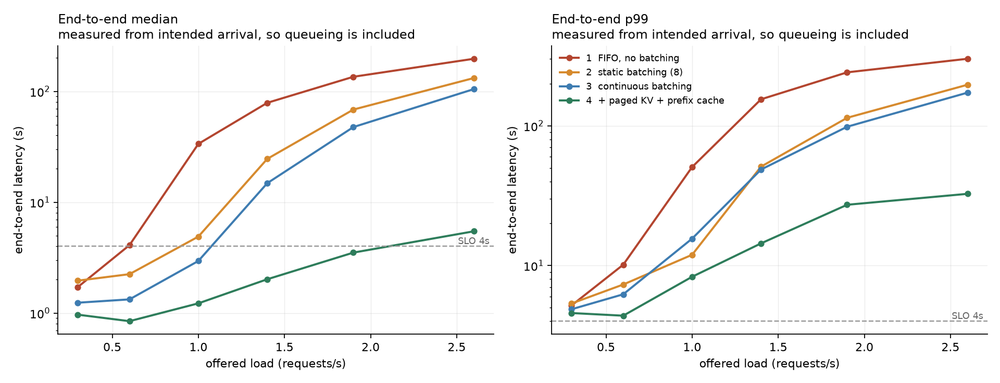

The knee is where each rung's line leaves the floor: FIFO at ~0.5 rps, static
at ~0.8, continuous at ~1.0, and continuous with caches at ~1.9. Past the knee
every configuration degrades — none of them holds p99 flat, because none of
them yet *refuses* work. That is precisely the gap Week 4's admission
controller exists to close, and it is why this chart is the "before" picture
rather than the result.

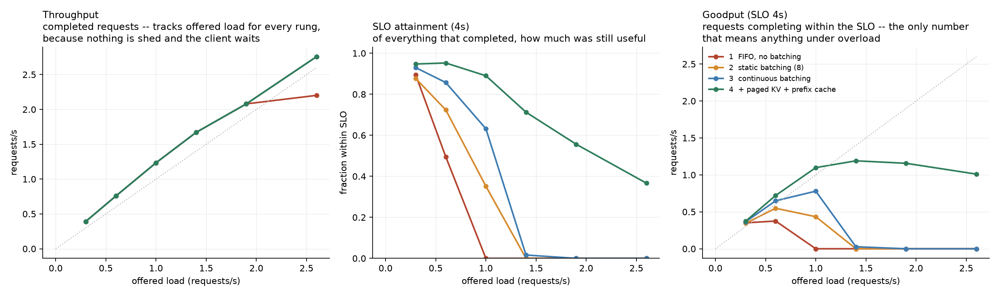

The left panel is the trap. With nothing shed and a client that waits up to
300 s, completed requests per second is identical across all four rungs to
within 1% — and so is output token throughput (26.3, 41.5, 73.4, 111.0, 132.5,
170.8 tok/s at the six offered loads, varying by under 1.5% between rungs). A
scheduler with no admission control decides *when* work completes, not whether.
Read alone, "throughput" would say these four configurations are the same
system. Goodput says one of them serves 3.2× as many users inside the SLO.

#### The Week 1 exit number: what FIFO actually saturates at

*(The build guide asks for a separate `results/w1_fifo.parquet` here. The FIFO
baseline is `results/w2_ladder/fifo.parquet` instead — a second copy of the
same rows is two things that can drift, and the ladder file is the one the
charts and tables are generated from.)*

Measured from the sustained completion rate in the middle 60% of the three
overloaded FIFO runs: **0.87–0.92 requests/s**, at a mean output of 63–66
tokens, i.e. **55–61 output tokens/s**.

The request-rate figure is the less trustworthy of the two, and it is worth
saying why. The workload's mean requested output is 136 tokens, but the
requests FIFO *completes* under overload average 63 — long generations take
longer, so within the client's 300 s timeout the short ones finish and the long
ones do not. "Requests per second" is therefore inflated by survivorship. Token
throughput is not, and 57 tok/s matches the calibrated single-stream figure
almost exactly (0.33 s of prefill plus 63 tokens at 81.5 tok/s is 1.10 s per
request, or 0.91 rps). Two numbers that should agree, agreeing, for a reason
that can be stated.

### The full sweep

<!-- SWEEP -->

| Config           |   Offered (rps) |   Requests |   Throughput |   Goodput |   SLO met |   TTFT p50 |   TTFT p99 |   ITL p50 |   ITL p99 |   E2E p50 |   E2E p99 |
|:-----------------|----------------:|-----------:|-------------:|----------:|----------:|-----------:|-----------:|----------:|----------:|----------:|----------:|
| fifo             |             0.3 |         57 |        0.392 |     0.351 |     0.895 |      0.575 |      4.667 |     0.012 |     0.015 |     1.715 |     5.183 |
| fifo             |             0.6 |        105 |        0.757 |     0.375 |     0.495 |      3.229 |      9.879 |     0.013 |     0.015 |     4.097 |    10.137 |
| fifo             |             1   |        182 |        1.234 |     0     |     0     |     33.276 |     49.585 |     0.013 |     0.015 |    33.593 |    50.668 |
| fifo             |             1.4 |        247 |        1.67  |     0     |     0     |     77.617 |    153.923 |     0.013 |     0.015 |    78.816 |   154.639 |
| fifo             |             1.9 |        311 |        2.079 |     0     |     0     |    133.941 |    240.352 |     0.013 |     0.015 |   135.411 |   241.048 |
| fifo             |             2.6 |        412 |        2.202 |     0     |     0     |    194.802 |    299.963 |     0.013 |     0.015 |   196.861 |   301.513 |
| static           |             0.3 |         57 |        0.392 |     0.344 |     0.877 |      0.442 |      3.713 |     0.013 |     0.02  |     1.959 |     5.354 |
| static           |             0.6 |        105 |        0.757 |     0.548 |     0.724 |      1.109 |      4.505 |     0.013 |     0.031 |     2.242 |     7.315 |
| static           |             1   |        182 |        1.234 |     0.434 |     0.352 |      2.798 |     10.404 |     0.017 |     0.042 |     4.894 |    11.941 |
| static           |             1.4 |        247 |        1.67  |     0     |     0     |     21.966 |     47.044 |     0.024 |     0.043 |    24.597 |    50.989 |
| static           |             1.9 |        311 |        2.079 |     0     |     0     |     63.776 |    112.019 |     0.025 |     0.043 |    68.498 |   114.001 |
| static           |             2.6 |        412 |        2.757 |     0     |     0     |    129.126 |    194.54  |     0.024 |     0.043 |   131.96  |   196.672 |
| continuous       |             0.3 |         57 |        0.392 |     0.364 |     0.93  |      0.35  |      0.613 |     0.015 |     0.303 |     1.239 |     4.868 |
| continuous       |             0.6 |        105 |        0.757 |     0.649 |     0.857 |      0.365 |      0.907 |     0.016 |     0.318 |     1.328 |     6.227 |
| continuous       |             1   |        182 |        1.234 |     0.78  |     0.632 |      0.441 |      1.682 |     0.022 |     0.378 |     2.95  |    15.581 |
| continuous       |             1.4 |        247 |        1.67  |     0.027 |     0.016 |      7.07  |     20.691 |     0.07  |     0.481 |    14.843 |    48.622 |
| continuous       |             1.9 |        311 |        2.079 |     0     |     0     |     38.466 |     75.989 |     0.069 |     0.49  |    47.613 |    98.39  |
| continuous       |             2.6 |        412 |        2.757 |     0     |     0     |     95.323 |    155.992 |     0.069 |     0.494 |   104.845 |   172.648 |
| continuous+cache |             0.3 |         57 |        0.392 |     0.371 |     0.947 |      0.067 |      0.445 |     0.015 |     0.057 |     0.966 |     4.573 |
| continuous+cache |             0.6 |        105 |        0.757 |     0.721 |     0.952 |      0.066 |      0.59  |     0.017 |     0.071 |     0.844 |     4.378 |
| continuous+cache |             1   |        182 |        1.234 |     1.098 |     0.89  |      0.067 |      0.801 |     0.02  |     0.336 |     1.223 |     8.313 |
| continuous+cache |             1.4 |        247 |        1.67  |     1.19  |     0.713 |      0.099 |      0.91  |     0.038 |     0.366 |     2.017 |    14.405 |
| continuous+cache |             1.9 |        311 |        2.079 |     1.157 |     0.556 |      0.32  |      1.179 |     0.058 |     0.401 |     3.509 |    27.212 |
| continuous+cache |             2.6 |        412 |        2.757 |     1.01  |     0.367 |      0.525 |      3.942 |     0.072 |     0.435 |     5.464 |    32.592 |

<!-- /SWEEP -->

### The SLO is a choice, so here is what it changes

<!-- SLO -->

|   SLO (s) |   FIFO, no batching |   Static batching (8) |   Continuous batching |   + paged KV + prefix cache |
|----------:|--------------------:|----------------------:|----------------------:|----------------------------:|
|         2 |                0.22 |                  0.35 |                  0.52 |                        0.84 |
|         3 |                0.28 |                  0.48 |                  0.62 |                        1.07 |
|         4 |                0.37 |                  0.55 |                  0.78 |                        1.19 |
|         6 |                0.58 |                  0.81 |                  1.01 |                        1.45 |
|         8 |                0.66 |                  0.98 |                  1.11 |                        1.81 |

<!-- /SLO -->

The ordering of the four rungs is identical at every target from 2 s to 8 s,
and rung 4 leads rung 1 by between 2.5× and 3.8× throughout. The conclusion
does not depend on where the line was drawn.

### Where the time goes

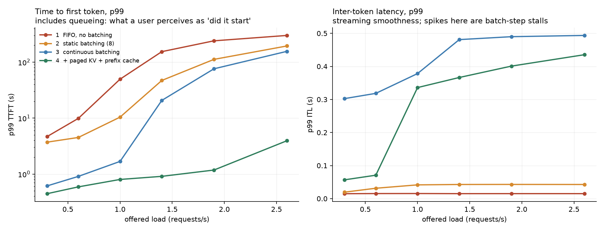

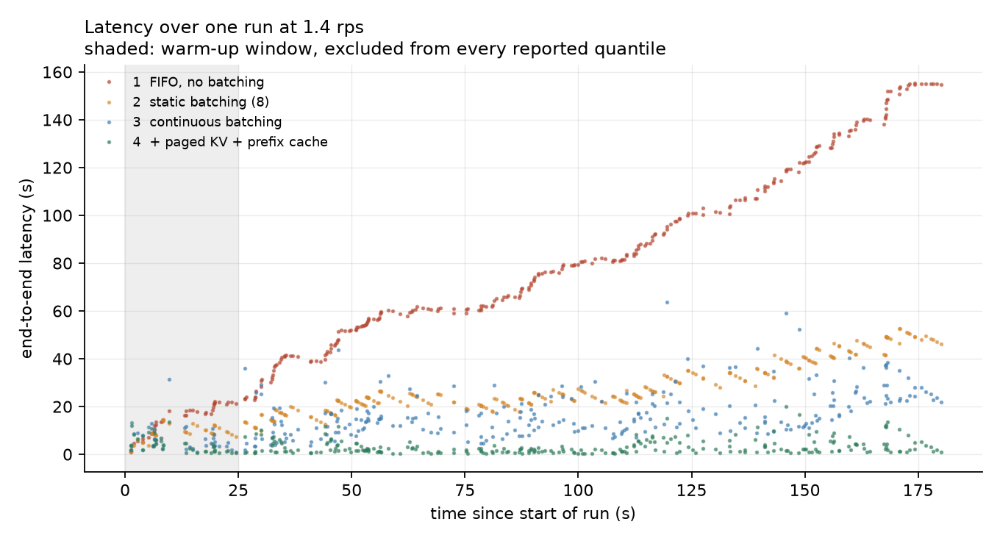

The single run at 1.4 rps is worth reading closely. FIFO climbs linearly and
without bound — the queue never drains, which is the open-loop signature a
closed-loop harness cannot produce. Static batching draws visible sawtooth
waves: each ramp is one batch filling while the previous one finishes, and each
drop is a wave completing. Continuous batching scatters, because a request's
latency stops being a function of who it queued behind.

### Prefix cache

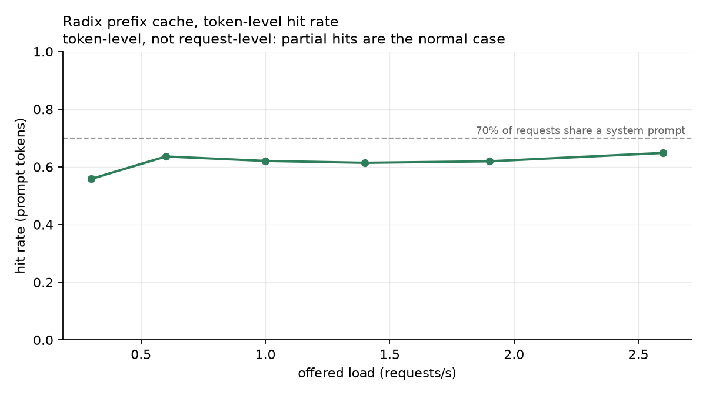

65% of prompt tokens are served from the radix cache, against a workload where
70% of requests share a system prompt and each shared prompt is ~92% reusable
(the differing user turn is the remaining 8%) — a ceiling of about 64%, which
it reaches. The rate is token-level, not request-level, because partial hits
are the normal case.

### Methodology summary

<!-- METHOD -->

- Runs: 24 (4 configurations x 6 offered loads x 1 seed)
- Requests issued: 6,332; analysed in steady state: 5,256
- Per run: 180s of arrivals, first 25s and last 5s excluded from every quantile
- Inter-arrival KS test against Exp(lambda), one per distinct arrival realisation: 0/6 pass at alpha=0.05 (median p = 0.005). See `results/loadgen_validation.json` and the note below.
- Client-side scheduling slip (actual send minus intended arrival): p99 2.8 ms, max 87 ms

<!-- /METHOD -->

Every number above is regenerated from the committed parquet by
`bench/make_report.py` and substituted into this file by
`bench/embed_tables.py`; `--check` fails CI if the two ever disagree.

---

## Week 3: the C++17 core, and what it was actually worth

The rule this week opens with is that the port has to be motivated by a
measurement, and the measurement has to be reported whichever way it comes out.
It came out against the port, and that is the interesting part.

### The profile came first, and it says these structures are not hot

`py-spy` needs `task_for_pid` and therefore root on macOS, and running the
server under test as root changes the server under test. So the gateway samples
itself: `cadence/obs/profiler.py` is a sampling profiler on the same principle
— snapshot the interpreter's per-thread stacks at a fixed rate — from a thread
that needs no privileges. Two details make its output checkable rather than
impressionistic. Samples are weighted by the interval they actually cover, not
counted, because the sampler competes for the GIL and its wake-ups jitter; and
the realised rate and the number of missed wake-ups are written down next to
the profile rather than assumed — 59 277 samples at an achieved 381 Hz, none
missed, for the run below.

If you would rather have py-spy's own view of the same process, it will attach
to a running gateway with elevated permissions and should agree:

```bash
sudo py-spy record --pid $(pgrep -f cadence.api.app) --duration 60 \
     --threads -o /tmp/cadence.svg
```

`uv run bench/profile_core.py --rate 1.9 --duration 150` runs the gateway under
a real open-loop load with the sampler on, at the offered load nearest rung 4's
knee, and produces this:

<!-- CORE_PROFILE -->

| KV core          | Component             | Inclusive   | Self   |
|:-----------------|:----------------------|:------------|:-------|
| Python reference | scheduler             | 100.00%     | 0.00%  |
| Python reference | model runner          | 100.00%     | 92.57% |
| Python reference | tokenizer (llama.cpp) | 4.20%       | 4.20%  |
| Python reference | sampling (numpy)      | 3.23%       | 3.23%  |
| Python reference | kv: radix cache       | 0.02%       | 0.00%  |
| C++17 core       | scheduler             | 100.00%     | 0.00%  |
| C++17 core       | model runner          | 100.00%     | 92.73% |
| C++17 core       | tokenizer (llama.cpp) | 4.06%       | 4.06%  |
| C++17 core       | sampling (numpy)      | 3.21%       | 3.21%  |

* **Python reference**: 59,277 samples at 381 Hz over 155 s, of which the scheduler thread was busy 99%. 2,180 engine steps, mean 70.3 ms. 324 completed requests at 1.9 rps.
* **C++17 core**: 59,932 samples at 387 Hz over 155 s, of which the scheduler thread was busy 98%. 2,671 engine steps, mean 56.8 ms. 324 completed requests at 1.9 rps.

<!-- /CORE_PROFILE -->

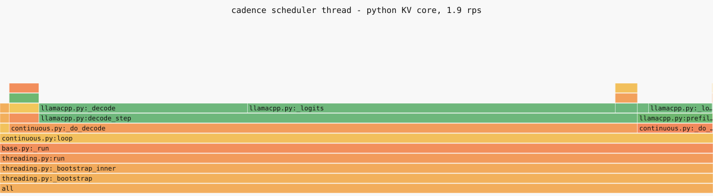

*Rendered from the committed folded stacks by `bench/core_report.py`; the C++
arm is `docs/figs/w3_flamegraph_cpp.svg`. Open either directly for per-frame
tooltips.*

The block manager and the radix cache never appear as the innermost frame at
all. On the Python arm they are on the stack for **0.02%** of the scheduler
thread's busy time and account for none of it to two decimal places; on the
C++ arm they do not appear in 59 932 samples at all. The forward pass is
92.6%, and it is split across `_decode` and `_logits` because
`llama_get_logits_ith` forces the deferred `llama_synchronize` — the compute is
charged where it is waited for, not where it is launched. llama.cpp's own
tokenizer is 4.2% and greedy sampling through numpy is 3.2%.

One difference between the two arms is worth not over-reading: the C++ arm ran
**2 671 steps averaging 56.8 ms** where the Python arm ran **2 180 averaging
70.3 ms**. Same completions, same throughput, same offered load — the loop
divided identical work into more, shorter steps. It is visible in the engine's
own histogram and in nothing a client can see.

So the honest answer to "profile first, then port if the profile says they are
hot" is: **the profile says they are not hot.** They are three orders of
magnitude away from mattering.

### Ported anyway, for the reasons that survive that answer

The guide's own instruction for this outcome is to say which it was and port
them regardless, for the per-step allocation-free guarantee. That is a real
reason and it is not the one that turned out to matter. What the port bought
was **correctness the pure-Python version had been getting away with**, and an
interface written down in a form that can be checked.

**A latent crash, found by pointing a profiler at a configuration the ladder
never reached.** The first thing the profiling run did was kill the engine
thread inside a minute:

```
RuntimeError: cannot share free block 810
  continuous.py:_schedule -> _admit -> block_manager.py:share
```

Admission matches a cached prefix, discovers it is short of blocks, and calls
`_reclaim`, which evicts by LRU. Under enough pressure the node it evicts is
the one that was just matched — so `hit.block_ids` names blocks that are back
on the free list, and `share()` refuses them. In Python that is an exception
that takes down the engine thread. It is also the exact shape of a
use-after-free: had the port handed the scheduler a `Node*`, the same sequence
would have dereferenced freed memory instead of raising.

The fix is `_pinned_match`: a match is held for the length of the admission
decision, so the decision sees one consistent view of the cache from match to
admit. Re-matching after each eviction would have been the smaller change and
it is the wrong one — it leaves the same window open one line further down, and
it spends the cached prefix to buy a batch slot the request may not take. Two
regression tests cover it, and both fail without the pin.

That bug was reachable on the committed Week 2 source. It did not fire during
the Week 2 ladder because that configuration never reached the pressure it
needs; the mock backend at 4 rps reaches it in under a minute.

**The C++ makes the dangerous case loud rather than lethal.** Node identity
across the boundary is a generation-stamped handle looked up in a registry, not
a `Node*` in a Python object. A stale handle raises `radix node N has been
evicted` instead of dereferencing freed memory, and `NodeRef.alive` lets a test
assert the distinction. The Python `Node` keeps its object identity after
eviction and loses its parent; the differential test asserts that those two
states mean the same thing on every operation.

**The GIL was doing load-bearing work.** The build guide recommends
`py::call_guard<py::gil_scoped_release>` around `match`. Measured, a bound
no-op costs 48 ns and releasing and re-acquiring the GIL adds 35 ns to it —
a 73% overhead on the call frame, against a `match` whose own work is a
handful of hash lookups. That is a pessimisation, not an optimisation. The larger cost is correctness: holding the GIL for the whole of
every binding call is what makes each operation atomic against the `/stats`
endpoint, which reads `n_nodes()` from the API thread while the scheduler
thread is splitting nodes. Under Python that concurrency is a torn read;
with the GIL dropped in C++ it would be a data race over a tree another thread
is restructuring. So the port does not take the guide's advice, and the reason
is a number rather than a preference.

### The microbenchmark, and the thing it found

<!-- CORE_BENCH -->

**Longest-prefix match, by prompt length**

|   Prompt tokens |   Python (us) |   C++ (us) |   of which pybind11 marshalling | Speedup   |
|----------------:|--------------:|-----------:|--------------------------------:|:----------|
|             128 |          4.55 |       2.69 |                            2.04 | 1.7x      |
|             256 |          8.96 |       4.87 |                            4.52 | 1.8x      |
|             512 |         18.81 |       8.8  |                            9.16 | 2.1x      |
|            1024 |         39.48 |      19.1  |                           19.6  | 2.1x      |
|            2048 |         86.61 |      37.02 |                           33.79 | 2.3x      |

**Allocator operations**

| Operation                                |   Python (us) |   C++ (us) | Speedup   |
|:-----------------------------------------|--------------:|-----------:|:----------|
| can_append (once per sequence per token) |         0.246 |      0.16  | 1.5x      |
| alloc + release of a 34-block table      |         4.175 |      1.272 | 3.3x      |

**What that is as a share of one engine step** (mean step 70.3 ms, measured)

|   Running batch | Python   | C++     | Python, share of a step   | C++, share of a step   |
|----------------:|:---------|:--------|:--------------------------|:-----------------------|
|               8 | 22.7 us  | 11.4 us | 0.032%                    | 0.016%                 |
|              12 | 24.7 us  | 12.6 us | 0.035%                    | 0.018%                 |
|              24 | 30.6 us  | 16.5 us | 0.044%                    | 0.023%                 |

**The price of releasing the GIL, which is why the port does not**

| Measurement                                  |   ns per call |
|:---------------------------------------------|--------------:|
| a bound no-op, GIL held throughout           |            48 |
| the same no-op, GIL released and re-acquired |            83 |
| cost of the release/re-acquire pair          |            35 |

<!-- /CORE_BENCH -->

Two results worth more than the speedup column.

**Almost all of the C++ `match` call is the pybind11 boundary.** Timing a
function that does nothing but accept the same prompt list gives essentially
the whole cost of the real call: converting a 512-element Python list into a
`std::vector<int32_t>` is the work. The tree walk itself — a handful of hash
lookups over block-sized keys — is below the noise floor of the measurement.
Any further optimisation of this structure would have to change how the prompt
crosses the boundary, not what happens after it arrives.

**The Python reference was quietly quadratic, and fixing it was part of doing
this honestly.** `match` compared each node's edge against `token_ids[i:limit]`
— a fresh slice of up to the whole remaining prompt, on every node visited, so
a 512-token lookup copied ~30 slices to compare a few hundred integers.
Comparing in place removes the only super-linear term. It also cuts the
measured C++ advantage roughly in half, which is exactly why a comparison
against an unoptimised reference is not a comparison.

### End to end: the delta is nothing, and it had to be

Two rungs identical in every respect except `CADENCE_KV_CORE`, run through the
same rate-major, rotated-order runner the ablation ladder uses, so the
comparison is protected from thermal drift the same way:

<!-- CORE_AB -->

| KV core          |   Offered (rps) |   Throughput |   Goodput |   SLO met |   TTFT p50 |   ITL p99 |   E2E p50 |   E2E p99 |
|:-----------------|----------------:|-------------:|----------:|----------:|-----------:|----------:|----------:|----------:|
| C++17 core       |             1   |        1.234 |     1.085 |     0.879 |      0.069 |     0.352 |     1.279 |     8.655 |
| Python reference |             1   |        1.234 |     1.085 |     0.879 |      0.068 |     0.352 |     1.275 |     8.517 |
| C++17 core       |             1.4 |        1.67  |     1.19  |     0.713 |      0.095 |     0.384 |     2.143 |    14.894 |
| Python reference |             1.4 |        1.67  |     1.19  |     0.713 |      0.113 |     0.382 |     2.08  |    14.796 |
| C++17 core       |             1.9 |        2.079 |     1.023 |     0.492 |      0.436 |     0.438 |     4.037 |    30.751 |
| Python reference |             1.9 |        2.079 |     1.05  |     0.505 |      0.42  |     0.42  |     3.954 |    28.584 |

**C++ relative to Python**

|   Offered (rps) | Goodput   | Throughput   | TTFT p50   | ITL p99   | E2E p99   |
|----------------:|:----------|:-------------|:-----------|:----------|:----------|
|             1   | +0.0%     | +0.0%        | +1.7%      | -0.2%     | +1.6%     |
|             1.4 | +0.0%     | +0.0%        | -15.9%     | +0.5%     | +0.7%     |
|             1.9 | -2.5%     | +0.0%        | +3.8%      | +4.3%     | +7.6%     |

<!-- /CORE_AB -->

Throughput is identical to three decimal places at every rate. Goodput is
identical at 1.0 and 1.4 rps and 2.5% *lower* for the C++ arm at 1.9; p50 TTFT
is 16% lower for C++ at 1.4 rps and 4% higher at 1.9. The signs disagree across
rates and across metrics, which is what noise looks like — the Week 2
replicates put run-to-run spread at 1.7%, and 1.9 rps is past rung 4's knee
where the spread is larger still. There is no effect here to attribute.

The arithmetic said so before the run did. The KV bookkeeping is 23–31 µs per
step in Python and 11–17 µs in C++ across the plausible batch range, against a
**measured mean step of 70 ms**: 0.03% of a step becoming 0.02% of a step.
Nothing downstream of that can move a latency percentile.

That is the honest framing and it is the one worth having: **a 2.1× 
microbenchmark win is a 0% end-to-end win here, because the 0.5B model's
forward pass is roughly four orders of magnitude more expensive than the
bookkeeping around it.** The port would start to pay as that ratio closes —
bigger batches, a smaller or quantised-further model, faster hardware, or
speculative decoding where the scheduler runs several times per accepted token
— and that is a hypothesis this repository has not tested rather than a result
it has.

### Proving the port is correct, not just fast

Two independent lines of evidence, because "I rewrote it in C++" is a claim.

**The specification's own tests run against both.** Every hand-written test in
`tests/test_block_manager.py` and `tests/test_radix_cache.py` is parametrised
over the two implementations: thirteen cases in each file, run twice — 52
test executions in all. The Python module *is* the
specification, so correctness means passing the specification's tests, not
only agreeing with it on random inputs. Making that
possible is why the caches grew a `paths()` method: a test that asserted on
`root.children` could only ever run against one of them.

**Differential fuzz.** `tests/test_kv_parity.py` draws random operation
sequences — allocate, share, fork, append, insert, match, pin, evict — and
drives both implementations through them in lockstep, comparing every
observable after every step: matched token counts, hit rates, node liveness,
eviction counts, the owner sequences handed back to the scheduler, **and the
block ids themselves**. The guide suggests not comparing block ids because they
are an implementation detail; here they are not, because both allocators are
LIFO stacks driven by the same operation sequence, so an id is a function of
the input and asserting on it turns a class of bookkeeping bugs from
"eventually visible" into "visible on the operation that caused it".

600 sequences of 30–200 operations run on every PR, 5 000 on `main`. A
differential test that never reaches an interesting state passes for the wrong
reason, so each sequence reports what it exercised, and the distribution is in
the CI log rather than assumed:

| Reached at least once | Share of the 5 000 sequences |
|---|---:|
| a prefix hit | 40% |
| a copy-on-write | 65% |
| an eviction | 90% |
| an edge split | 28% |
| the block pool exhausted | 9% |

### What the two implementations agree on, in the type system

`cadence/engine/kv/protocols.py` is the interface the scheduler depends on, and
`build_kv` is annotated as returning it, so if either implementation drifts
from the other's surface mypy says so before a benchmark does. Writing it down
found the one place where the claim is false: a prefix-cache *node* is not
interchangeable — the Python cache hands out a `Node` and the C++ one a
`NodeRef`, and neither accepts the other's. The contract the scheduler actually
honours is narrower than a shared type would express ("hand the handle back to
the cache that gave it to you"), so the protocol says `Any` and says why. mypy
runs enforced rather than advisory from this week.


---

## Week 4: predicting latency, and refusing work on a guarantee

Everything before this week is table stakes for an inference gateway. This is
the week the project's headline claim — *holds p99 under overload* — either
becomes true or does not, and the ladder up to rung 4 exists to make the
difference legible.

### The idea, in one paragraph

A request's end-to-end latency is not knowable in advance, but it is
*predictable with quantified uncertainty*. Fit a model that maps (prompt
features, current system state) to conditional quantiles of latency; use
split-conformal prediction on a held-out calibration set to turn that estimate
into an upper bound `U(x)` that is correct at least 99% of the time, with a
finite-sample, distribution-free guarantee that assumes nothing about the model
being right. Admit a request only if `U(x)` fits inside its SLO budget.
Everything else is refused immediately with a 503 and a `Retry-After`, which
frees the capacity for the requests that can still be served in time. The p99
target stops being a hope and becomes a property of the admission rule.

### Why an interval, and not a point prediction

Because the dominant source of uncertainty is not model error — it is the
output length, which is genuinely unknown at admission time.

This workload's requested output lengths are lognormal (µ=4.6, σ=0.8, capped at
512), and a request that stops at its first EOS and one that runs to 512 tokens
differ by more than 6 s of decode on this machine. No feature available at
admission distinguishes them, because which one happens depends on what the
model decides to say. A point predictor that is right on average therefore
admits about half of the requests that will miss their deadline; the quantity
the policy needs is the *tail*, and an interval method is the correct tool
rather than a flourish.

That is also why the base model is quantile regression rather than a
least-squares fit with a fudge factor: two gradient-boosted quantile regressors
(`cadence/admission/predictor.py`) give a *heteroscedastic* interval — wide when
the system is loaded and the prompt is long, narrow when it is idle — and the
conformal step then repairs that estimate's calibration without destroying its
adaptivity.

### What the model may see, and the leak it structurally cannot have

The failure mode that would invalidate every number below is a feature that is
only knowable after the request ran. It produces a spectacular model and a
coverage guarantee that means nothing.

The defence here is structural rather than a matter of discipline.
`features.extract` takes exactly two arguments: an `AdmitContext`, which holds
the prompt, the requested cap, the message count and the prefix-cache probe,
and a `Snapshot`, which is a frozen record of engine scalars. Neither holds a
reference to the `Request` object, and the `Request` is where every
after-the-fact field lives — `output_ids`, `finish_reason`, the completion
timestamp. A leaking feature could not be written without widening one of those
two signatures, which is a diff a reviewer sees.
`tests/test_admission.py::test_the_feature_extractor_cannot_reach_the_outcome`
asserts exactly that, as a property of the types rather than of the values.

The fourteen features are seven request-intrinsic (prompt tokens, cached prefix
tokens, new prefill tokens, `max_tokens` and its log, message count, whether the
prefix hit exceeds 256 tokens) and seven system-state (queue depth, running
batch size, summed remaining output tokens, free KV fraction, EWMA step latency,
EWMA token rate, arrival-rate estimate). `max_tokens` is the client's *cap*, not
the realised length, so it is legitimately admission-time — and it is the single
most informative feature, because it bounds the decode work.

The system half comes from `BaseScheduler.snapshot()`, which is read from the
API thread and written by the engine thread without a lock. That is a decision,
not an oversight: every field is a scalar, so a reader sees an old value or a
new one and never a torn one, and the worst case is a feature vector whose
fields were never simultaneously true. Locking would put the admission path on
the engine thread's critical path to buy an accuracy improvement smaller than
the measurement noise — and admission has to be cheap, because it runs on every
arrival, including the ones about to be refused. The prefix-cache probe is
best-effort for the same reason and one more: it takes no reference and mutates
nothing, so a torn read costs the predictor a little accuracy and cannot corrupt
the cache.

### Two features that the controller's own behaviour invalidated

Both were found by running the thing, and neither would have shown up in an
offline evaluation, because both are failures of the *intervention* rather than
of the fit. They are the most interesting results of the week.

**The arrival rate had to be removed.** The build guide's feature list ends
with `arrival_rate_ewma`, and in a trace collected with admission off it is
strongly predictive — offered load and latency move together, which is what the
Week 2 ladder is a picture of. But offered load raises latency *by filling the
queue*, and a controller that sheds is precisely the intervention that severs
that path: the queue stays empty while the offered rate stays exactly where it
was. A model fitted on observational data cannot tell those two situations
apart.

The measured consequence, from the first deployed run: with the arrival rate in
the feature set the controller admitted **57% of a 0.6 rps load and 1% of a
1.9 rps load — with the queue empty and the batch empty in both cases.** The
only input that had changed was the one encoding how much work was being
offered, and the model dutifully raised its bound for a system that was sitting
idle. Shedding then kept it idle, and the offered rate — which counts arrivals
rather than admissions, deliberately — kept the bound high. That run is kept in
`results/w4_admission_confounded/` and the rule it produced is written down in
`cadence/admission/features.py`: every remaining system-state feature is a
*measured consequence* of congestion rather than a cause of it, so each stays
true under the intervention because it is the mechanism the intervention works
through.

**The engine had to warm itself up.** Two of the features are EWMAs of step
latency and token rate. An engine that has never run a step reports both as
zero — a combination that appears nowhere in the training set, because the
collection drops each block's first twenty seconds. The model extrapolates,
the bound comes out two to three times too large, the request is shed, and the
engine stays idle with the EWMAs still at zero.

That is a closed loop with no exit, and it closed: a gateway that should have
admitted most of a 1 rps load shed **89 requests out of 89**, including the load
generator's own warm-up request, which arrives through the same door as
everything else. `Engine.start()` now runs a four-token generation through the
scheduler before the server accepts traffic, where admission cannot refuse it.
The prompt is shorter than one KV block, so it donates nothing to the prefix
cache and the first real arrival still finds a cold one.

The two failures rhyme, and the moral is one sentence: **a feature that is
valid for prediction is not automatically valid for control**, because the
controller changes the thing being measured.

### Collecting the training set, and the two ways a split can lie

Traces are collected by the gateway itself, one JSONL row per request: the
feature vector as the controller would have seen it, then what happened. Not
reconstructed afterwards from the client's parquet — features assembled later
would carry queue depths sampled at some other moment, and the model would be
fitted on a system that never existed.

The collection runs with admission **off**, so the rows are a sample of the
latency distribution rather than a sample of what a previous controller allowed.
Requests the client abandoned are marked censored and dropped: a 300 s timeout
is a lower bound on that request's latency, and training on it teaches the model
that the worst case is exactly the client's timeout.

Then the split, which is where this experiment could most easily have lied to
itself. The build guide's rule — split by time, never at random, because
adjacent requests share queue conditions — is right and is not sufficient here:

* A **global time split** puts whole offered loads into whole folds, because the
  collection visits several. The three folds then sample three different
  distributions, and exchangeability is broken by the split rather than by the
  system.
* A **time split within each load** fixes that and introduces a subtler failure,
  which is the one that actually bit during development: inside an overloaded
  block the queue grows monotonically, so the last 20% of the block holds the
  deepest queues, and a tree model asked to predict them is extrapolating past
  every split point it was fitted with. Measured coverage collapsed to 0.34 —
  not because conformal prediction failed, but because calibration and test were
  not samples of the same thing.

So the unit of exchangeability here is the **run, not the request**. The
collection makes four rounds over the rate grid, rotating the order each time,
restarting the gateway for every (round, load) block; whole rounds become whole
folds — two to train, one to calibrate, one to test. Requests inside a fold stay
correlated with each other, which widens the interval on measured coverage and
is why that interval is reported; but a calibration request and a test request
never shared a queue, and every fold spans the whole range of load and the whole
life of a block. The other convention is kept and reported as a sensitivity
check, because the gap between the two numbers *is* a result.

### The bound, and the `(n+1)` that makes it finite-sample

The SLO is one-sided — only being too slow is a violation — so the
nonconformity score is one-sided too. On the calibration set, score each request
by how badly the model under-predicted it, `E_i = y_i − q_hi(x_i)`; take
`Q`, the `ceil((n+1)(1−α))/n`-th empirical quantile of those scores; the bound
for a new request is `U(x) = q_hi(x) + Q`. (That is the additive form. Which
score function to use is a free choice that does not affect validity, and on
this workload it decides everything else — see the next section but one; the
deployed one is multiplicative.)

The correction is worth being able to derive, because it is the difference
between a finite-sample statement and an asymptotic one. Under exchangeability,
the new request's own score is equally likely to occupy any rank among the `n+1`
scores including itself, so `P(E_{n+1} ≤ k-th smallest of n+1) = k/(n+1)`.
Taking `k = ceil((n+1)(1−α))` gives at least `1−α`, and that value is the `k`-th
of the `n` scores actually observed. Dividing by `n` gives the level above.
Using `n` instead of `n+1` throws away exactly the term that buys the guarantee.

It also explains the `n ≥ 100` guard in `conformal.py` rather than leaving it as
a superstition: the level is attainable only when `ceil((n+1)(1−α)) ≤ n`, which
for α=0.01 first happens at n=99. Below that, no order statistic of the
calibration set is high enough to be a 99% bound, and the honest answer is that
this much data cannot produce one.

### Two free choices that decided whether any of it worked

Conformal validity holds for *any* base model and *any* nonconformity score —
the argument is about the rank of the new score among the calibration scores,
and never about what the score means. That is usually presented as the method's
elegance. It is also a warning: both choices are free, so both are yours, and
on this workload they were the difference between a controller and a machine
that refuses everything.

**The base quantile level is not the guarantee level.** The build guide fits
the quantile pair at the same α the bound must hold at. At α=0.01 that asks a
gradient-boosted model to estimate the 99.5th conditional percentile from
~1 500 rows, of which about seven lie above it — and the fitted "upper
quantile" collapses to a near-constant **18 s for every input**. Calibrated,
that is perfectly valid (measured coverage 1.000) and completely useless: the
bound never drops below the SLO, so nothing is ever admitted. Because validity
does not depend on the base model, the base level is free to be chosen for
statistical stability instead: fitted at 90% the pair is estimated from
hundreds of rows, it tracks load and requested length instead of flattening,
and the conformal step inflates it to whatever the guarantee requires.

**The additive score is the wrong one for a quantity spanning two orders of
magnitude.** With `E = y − q_hi`, one additive correction is set by the worst
regime and then applied to the best: measured, Q = +24.7 s, which prices a
request that will take 0.6 s at 33 s. Scoring in the space the model is fitted
in — `E = log1p(y) − log1p(q_hi)`, so the correction is a multiplier — gives a
bound that means the same thing at both ends of the range. The textbook
locally-weighted alternative, dividing by the model's own interval width, is
included and fails informatively: the interval collapses towards zero for the
easiest requests, so the calibration quantile is set by the narrowest one in
the fold and lands at Q = 2.96 interval-widths.

Both were chosen on a slice of the *training* fold that the model does not see,
because a choice made on the calibration fold would tune the rows the bound is
then calibrated against, and a choice made on the test fold is a number that was
optimised for rather than measured. The comparison table below is reported, not
selected on.

### Does the model earn its place?

Conformal calibration gives *any* predictor the nominal coverage. That is the
method's strength and it is also a trap for the person reporting it: coverage
cannot distinguish a good model from a useless one. What a good model buys is a
**tighter** bound at the same guarantee, and therefore more admitted requests
under the same SLO — so the two baselines are fitted, calibrated and evaluated
identically, and the comparison is on bound width and on what each would admit.

<!-- PREDICTOR -->

| Model                             |   Coverage (target ≥ 99%) |   Q (log-ratio) |   Mean bound U (s) |   Median bound U (s) | Would admit   | of those, met SLO   |
|:----------------------------------|--------------------------:|----------------:|-------------------:|---------------------:|:--------------|:--------------------|
| Conformalised quantile regression |                     0.997 |           0.73  |              21.74 |                18.23 | 3.7%          | 100.0%              |
| Throughput arithmetic (fitted)    |                     0.995 |           0.03  |             105.96 |               105.66 | 3.3%          | 100.0%              |
| Constant quantile (no features)   |                     0.999 |           0.106 |              45.71 |                45.71 | 0.0%          | -                   |

The quantile pair is fitted at 90% and the bound is calibrated to 99%; the nonconformity score is `ratio`. Both were chosen on a held-out slice of the training fold, and neither can affect validity — only width:

| Nonconformity score                            |   Coverage |      Q |   Median bound U (s) | Would admit   |
|:-----------------------------------------------|-----------:|-------:|---------------------:|:--------------|
| absolute — `y − q_hi`, the build guide's       |     0.9986 | 24.697 |                32.96 | 0.0%          |
| ratio — `log1p(y) − log1p(q_hi)`  *(deployed)* |     0.9973 |  0.73  |                18.23 | 3.7%          |
| scaled — `(y − q_hi) / (q_hi − q_lo)`          |     1      |  2.956 |                26.98 | 3.3%          |

What the upper-quantile model leans on:

| Feature              |   Importance |
|:---------------------|-------------:|
| ewma_tokens_per_s    |        0.13  |
| queue_depth          |        0.122 |
| ewma_step_latency_s  |        0.119 |
| max_tokens           |        0.104 |
| log_max_tokens       |        0.101 |
| kv_blocks_free_frac  |        0.1   |
| sum_remaining_tokens |        0.1   |
| n_prompt_tokens      |        0.099 |

Safety factor, read off the same held-out split:

|   Safety factor | Would admit   | of those, met SLO   | Offline goodput (admitted ∧ in SLO)   |
|----------------:|:--------------|:--------------------|:--------------------------------------|
|            0.6  | 11.4%         | 97.6%               | 11.1%                                 |
|            0.7  | 9.1%          | 98.5%               | 8.9%                                  |
|            0.8  | 6.7%          | 98.0%               | 6.6%                                  |
|            0.9  | 5.4%          | 100.0%              | 5.4%                                  |
|            1    | 3.7%          | 100.0%              | 3.7%                                  |
|            1.1  | 2.2%          | 100.0%              | 2.2%                                  |
|            1.25 | 1.2%          | 100.0%              | 1.2%                                  |
|            1.5  | 0.3%          | 100.0%              | 0.3%                                  |

<!-- /PREDICTOR -->

All three cover — that is the guarantee doing its job, and it is why the
coverage column is not the interesting one. The interesting one is the width:
the learned model's mean bound is **21.7 s against the constant quantile's
45.7 s and the throughput arithmetic's 106 s**, on the same held-out requests
at the same 99% level. Half the bound is twice the admitted load at a fixed
SLO, which is the only currency this comparison is denominated in.

The throughput baseline is the one that matters, because it is what anyone
would write without a model, and it is *fitted* here rather than guessed —
prefill tokens, requested tokens and queued tokens, with three rates from least
squares on the same training split. It loses by 5× on bound width, and the
reason is visible in the feature importances: no single column dominates, and
the two the linear form does not have — the measured step latency and token
rate — carry more of the model than the requested output length does.

(There is deliberately no pinball-loss column. The learned model's quantile
pair is fitted at 90% and the baselines' at 99.5%, for the reason in the next
paragraph but one, so a proper scoring rule evaluated at one level would be
comparing three estimates of three different quantities. Bound width at equal
*calibrated* coverage is the comparison that is like for like, and it is the
one the controller feels.)


### Coverage, measured rather than asserted

<!-- COVERAGE -->

|    α |   Nominal (1−α) |   Empirical, offline | 95% CI           |   Q (log-ratio) |   Mean U (s) | Would admit   |
|-----:|----------------:|---------------------:|:-----------------|----------------:|-------------:|:--------------|
| 0.2  |            0.8  |               0.8503 | [0.8225, 0.8744] |          -0.005 |         9.9  | 19.9%         |
| 0.1  |            0.9  |               0.9299 | [0.9091, 0.9463] |           0.176 |        12.07 | 15.0%         |
| 0.05 |            0.95 |               0.9684 | [0.9530, 0.9789] |           0.355 |        14.63 | 10.6%         |
| 0.01 |            0.99 |               0.9973 | [0.9900, 0.9992] |           0.73  |        21.74 | 3.7%          |

And the same quantity measured while the controller was deciding — where the calibration set no longer describes what runs, because the controller chose it:

| Arm                            |   Nominal (1−α) |   Empirical, online |   Admitted and completed |   Censored (client gave up) |   Mean U (s) |   Mean realised E2E (s) |
|:-------------------------------|----------------:|--------------------:|-------------------------:|----------------------------:|-------------:|------------------------:|
| 5  + conformal admission (95%) |            0.95 |              0.9978 |                      894 |                           0 |         2.67 |                    0.78 |
| 5  + conformal admission (80%) |            0.8  |              0.876  |                     1387 |                           0 |         2.37 |                    1.37 |

<!-- /COVERAGE -->

Every offline point is on or above the diagonal, which is what a conservative
finite-sample bound should look like: at α=0.01 the measured coverage is
0.9973 on 728 held-out requests, and the four levels together trace the
calibration line rather than one point on it.

Two things about the online column are worth reading carefully, because they
are the ones the theory does not cover.

**The direction of the error is conservative, not optimistic.** The build guide
warns that a shedding controller invalidates exchangeability, and it does — but
here it does so in the *safe* direction. The 95% arm's mean bound was 2.67 s
and its admitted requests came back in 0.78 s on average, for a measured
coverage of 0.9978 against a promise of 0.95. The controller emptied the system
on behalf of the requests it admitted, so they ran on a machine the calibration
set never saw. Every one of those margins is goodput refused for nothing, and
that is the argument for the rolling recalibration below rather than an
argument that the bound is wrong.

**Outside the load range it was fitted on, the bound fails — visibly.** The
rung-4 arm of the sweep runs with admission off and the trace log on, which
makes it a second, entirely held-out test set, and one that reaches offered
loads the training set does not: coverage there is **1.00 at 0.6, 1.0 and
1.9 rps, 0.47 at 4 rps and 0.18 at 6 rps**. The training set was collected at
up to 3.4 rps, where the deepest queue seen was a few dozen requests and the
slowest response took 68 s; at 6 rps with nothing shed the median response
takes 110 s, and a gradient-boosted model asked about that state is
extrapolating past its last split point. This is exactly the exchangeability
assumption failing, measured rather than asserted — and it is also why the
number does not undermine the controller: with admission on, those states never
occur, which is what the online column says.


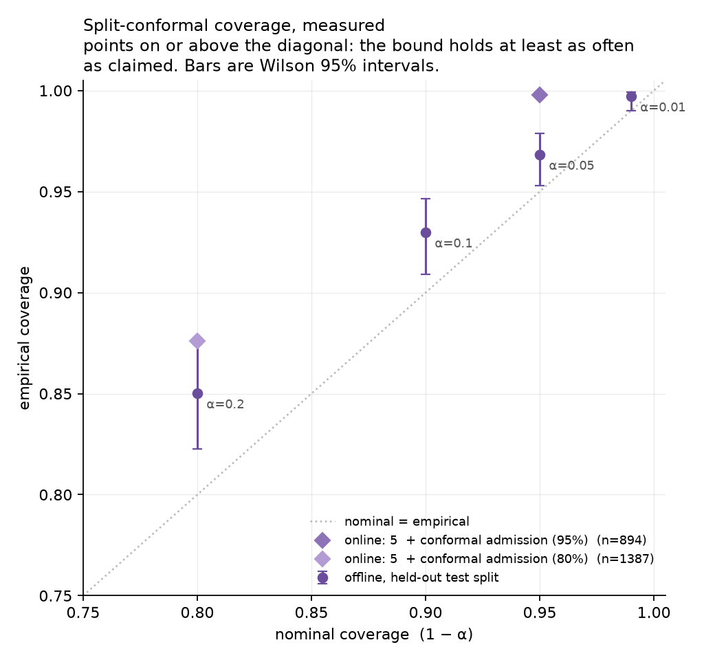

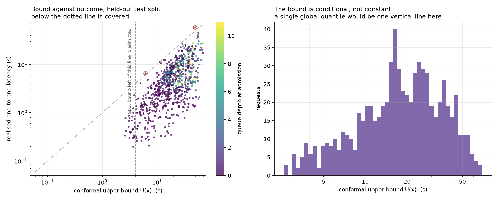

### The overload experiment

Four arms, identical in every respect except the admission policy — the
unmanaged rung 4, and the same controller asked for a 99%, a 95% and an 80%
per-request guarantee. Run rate-major with the arm order rotated between rates
and the gateway restarted for every (arm, rate) pair, which is the same
protection against thermal drift the Week 2 ladder uses.

The grid keeps three of Week 2's offered loads so the shared rung stays
comparable across the two sessions, and adds 4.0 and 6.0 rps: four and six
times the load at which this configuration's goodput peaks in this session
(1.0 rps), and two to three times the knee the Week 2 ladder measured
(≈1.9 rps). Either way it is past the point where the unmanaged system stops
returning anything on time.

<!-- ADMISSION -->

| Config                         |   Offered (rps) | Shed   |   Admitted (rps) |   Goodput (rps) | SLO met, all arrivals   | SLO met, admitted   | p50 E2E (s)   | p99 E2E (s)   | p99 TTFT (s)   |
|:-------------------------------|----------------:|:-------|-----------------:|----------------:|:------------------------|:--------------------|:--------------|:--------------|:---------------|
| 4  + paged KV + prefix cache   |             0.6 | 0%     |             0.76 |            0.72 | 95%                     | 95%                 | 0.87          | 4.56          | 0.61           |
| 4  + paged KV + prefix cache   |             1   | 0%     |             1.23 |            1.1  | 90%                     | 90%                 | 1.38          | 9.25          | 1.13           |
| 4  + paged KV + prefix cache   |             1.9 | 0%     |             2.08 |            0.96 | 46%                     | 46%                 | 4.31          | 28.84         | 1.95           |
| 4  + paged KV + prefix cache   |             4   | 0%     |             4.12 |            0    | 0%                      | 0%                  | 48.36         | 80.95         | 61.70          |
| 4  + paged KV + prefix cache   |             6   | 0%     |             5.93 |            0    | 0%                      | 0%                  | 110.05        | 203.59        | 186.92         |
| 5  + conformal admission (99%) |             0.6 | 100%   |             0    |            0    | 0%                      | -                   | -             | -             | -              |
| 5  + conformal admission (99%) |             1   | 100%   |             0    |            0    | 0%                      | -                   | -             | -             | -              |
| 5  + conformal admission (99%) |             1.9 | 100%   |             0    |            0    | 0%                      | -                   | -             | -             | -              |
| 5  + conformal admission (99%) |             4   | 100%   |             0    |            0    | 0%                      | -                   | -             | -             | -              |
| 5  + conformal admission (99%) |             6   | 100%   |             0    |            0    | 0%                      | -                   | -             | -             | -              |
| 5  + conformal admission (95%) |             0.6 | 80%    |             0.15 |            0.15 | 20%                     | 100%                | 0.47          | 1.73          | 0.40           |
| 5  + conformal admission (95%) |             1   | 53%    |             0.58 |            0.58 | 47%                     | 100%                | 0.55          | 1.80          | 0.44           |
| 5  + conformal admission (95%) |             1.9 | 59%    |             0.86 |            0.86 | 41%                     | 100%                | 0.59          | 1.97          | 0.55           |
| 5  + conformal admission (95%) |             4   | 65%    |             1.44 |            1.44 | 35%                     | 100%                | 0.68          | 2.50          | 0.68           |
| 5  + conformal admission (95%) |             6   | 65%    |             2.08 |            2.08 | 35%                     | 100%                | 0.71          | 2.42          | 0.62           |
| 5  + conformal admission (80%) |             0.6 | 19%    |             0.61 |            0.61 | 81%                     | 100%                | 0.63          | 2.71          | 0.46           |
| 5  + conformal admission (80%) |             1   | 26%    |             0.92 |            0.92 | 74%                     | 100%                | 0.81          | 3.13          | 0.60           |
| 5  + conformal admission (80%) |             1.9 | 34%    |             1.38 |            1.37 | 66%                     | 100%                | 0.89          | 3.57          | 0.72           |
| 5  + conformal admission (80%) |             4   | 47%    |             2.18 |            2.14 | 52%                     | 98%                 | 1.04          | 4.48          | 0.72           |
| 5  + conformal admission (80%) |             6   | 55%    |             2.7  |            2.53 | 43%                     | 94%                 | 1.30          | 6.62          | 1.00           |

<!-- /ADMISSION -->

**The headline, at 6 rps — six times the offered load at which this
configuration's goodput peaks, and past the point where the unmanaged system
returns nothing useful at all:**

| | no admission | 95% guarantee | 80% guarantee |
|---|---|---|---|
| p99 end-to-end | **203.6 s** | **2.42 s** | 6.62 s |
| Goodput (SLO 4 s) | **0.00 rps** | 2.08 rps | **2.53 rps** |
| SLO met, of everything offered | 0% | 35% | 43% |
| SLO met, of what was admitted | 0% | 100% | 94% |
| Shed | 0% | 65% | 55% |

Averaged over the three offered loads past saturation (1.9, 4.0 and 6.0 rps),
goodput is **4.6× the unmanaged system's at the 95% guarantee and 6.3× at the
80% one** — against an unmanaged mean of 0.32 rps, which is itself an average
of one working point and two zeros.

The p99 line is the claim the project was built to make, and it is now
measured: it does not merely improve, it *stops depending on offered load*.
Between 0.6 and 6 rps — a tenfold range — the 95% arm's p99 moves from 1.73 s
to 2.42 s. The unmanaged line over the same range moves from 4.56 s to 203.6 s.

And the cost is equally clear, because it is in the same table. **Below
saturation, admission control loses goodput**: at 0.6 rps the unmanaged system
delivers 0.72 rps within the SLO and the 95% arm delivers 0.15. It refuses
long requests that would in fact have made it, because their *predictive tail*
does not fit even when their median does. That is not a tuning failure — it is
what a per-request guarantee costs on a workload whose output lengths span
16 to 512 tokens, and the two arms bracket the trade: the weaker promise gives
up less at low load and holds a looser tail at high load.

The frontier between them is the actual result of the week. There is no single
"admission control" configuration to report — there is a knob, α, which sets
how strong a promise is made about each admitted request, and the measurement
says where each setting lands:

| Guarantee | p99 across the whole range | Goodput past saturation | Cost at 0.6 rps |
|---|---|---|---|
| 99% (α=0.01) | — | 0.00 rps | refuses everything |
| 95% (α=0.05) | 1.73–2.50 s, never above the SLO | 1.46 rps (4.6×) | 0.15 vs 0.72 rps |
| 80% (α=0.20) | 2.71–6.62 s, above the SLO past 4 rps | 2.01 rps (6.3×) | 0.61 vs 0.72 rps |
| none | 4.56–203.6 s | 0.32 rps | 0.72 rps |


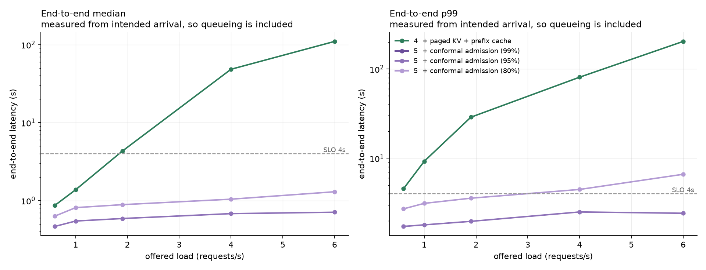

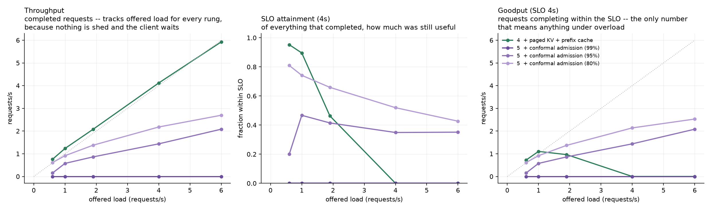

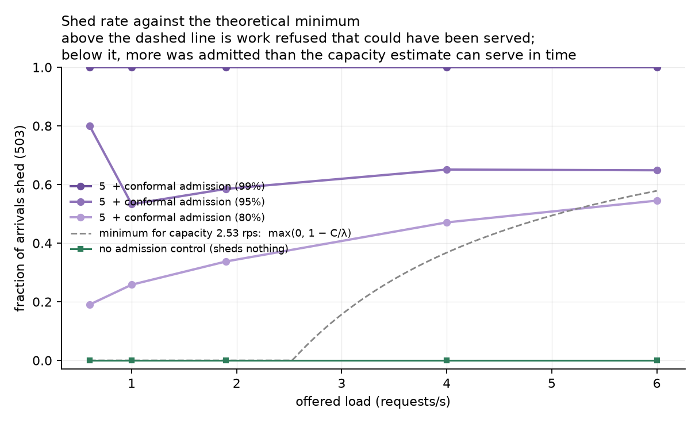

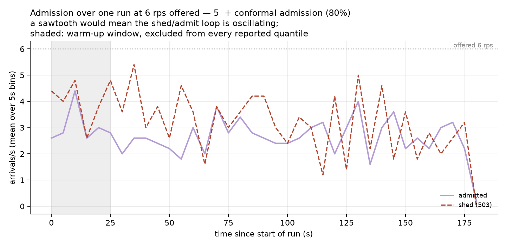

The last figure is the one that would have exposed a controller without
damping. Shedding is a positive feedback loop — shed, load falls, predictions
improve, admit, load rises — and an undamped version of it oscillates with a
period set by how long a request takes. It does not: over the steady window of
the 6 rps run, the admitted rate holds a mean of 2.69/s with a standard
deviation of **0.58 across 5 s bins, against the 0.73 a Poisson process of that
mean would produce on its own**, and a lag-1 autocorrelation of −0.22 on 30
bins, which is within noise of zero. The controller varies *less* than the
arrivals it is filtering, which is what a Schmitt trigger on a noisy signal is
supposed to do.

### The arm that refuses everything, and why that is a result

The 99% arm sheds 100% of arrivals at every offered load, including 0.6 rps on
an idle machine. Two things compound, and both are arithmetic rather than
misfortune.

**The budget is smaller than the workload's own tail.** Week 2 chose a 4 s SLO
from a calibration that put implied unloaded end-to-end latency at p50 1.56 s
and **p95 5.0 s**. A 99% per-request bound has to cover a request's own
99th percentile; for a workload whose 95th percentile exceeds the budget on an
*empty* server, almost no request can qualify. The measured bound for the
shortest requests in the mix sits at 3.2–3.8 s on a warm idle server — inside
the budget, but only just.

**And "warm" is where the second loop bites.** `n_cached_prefix_tokens` is a
feature, and a correct one: a request that hits a cached system prompt really
is seconds cheaper. But the cache is warmed *by admitted requests*. A
controller that refuses everything keeps it cold, every request then carries
540 tokens of prefill instead of 40, and the bound for even the shortest
request rises past the budget — which is the state that made it refuse in the
first place. Unlike the arrival rate, this feature is not confounded; the loop
is real. The system simply has two equilibria and this arm starts in the wrong
one. The measured signature is in the run log: the 99% arm's prefix hit rate is
0.00 at every load, while the arms next to it sit at 0.72–0.80.

The fix is not a smaller α — it is a warm start, the same shape of answer as
`Engine.warmup()`: admit a small exploration quota regardless of the bound,
long enough for the cache and the state features to reach the regime the model
was fitted in. That is a Week 5 item and it is not in this measurement, so the
99% row stays in the table as a zero.

### The same rung, measured twice

Rung 4 appears in the Week 2 ladder and again here as this sweep's control arm:
same workload, same seed, same duration, same SLO, same configuration, five
weeks and one differently-warm laptop apart. At the three offered loads they
share, goodput agrees to **0.02%, 0.6% and 16.8%** (0.72 vs 0.72, 1.10 vs 1.10,
0.96 vs 1.16 rps) and p99 to 4%, 11% and 6%. The 1.9 rps point is the outlier,
and it is the one at the knee, where a small difference in service rate moves a
lot of queue.

That is the number to hold against any comparison drawn across the two
sessions, and it is why the five-rung chart is not drawn: rungs 1–3 were
measured in the Week 2 session and rungs 4–5 in this one, so a single figure
with all five lines would imply an interleaving that did not happen.

### The policy, decision by decision

| Decision | Options | What this does, and why |
|---|---|---|
| Shed which requests? | longest predicted, newest arrival | Longest predicted. The bound *is* the predicted cost, so refusing on `U(x) > budget` sheds one expensive request instead of several cheap ones, which is the goodput-maximising choice. |
| Shed at arrival or at dequeue? | either, or both | At arrival. A dequeue-time re-check is implemented behind the same interface but is not part of the headline run: with the queue held short by arrival-time shedding there is little state change left to re-check, and an arm that is not run is not reported. |
| Queue discipline | FIFO / EDF / SJF | EDF, from Week 1 — `Request.__lt__` orders the wait queue by deadline. With a constant SLO that degenerates to arrival order, which is why the controller's action space here is two-valued rather than the guide's three: there is no "queue it with an earlier deadline" to choose, because admission does not decide queue position. SJF would raise raw goodput and starve long requests; it is a scheduler ablation, not an admission one. |
| Safety factor | 1.0, or tuned | 1.0. A tuned fudge factor with no measurement behind it is a red flag, so the trade-off is *reported* instead — see the safety sweep above, read off the held-out split. |
| Response to shed | 503 + `Retry-After` | Standard and honest. `Retry-After` is the queue's remaining decode work divided by the measured token rate, floored and capped — an estimate of when capacity will exist rather than a constant wearing a header's clothes. |
| Damping | none / hysteresis | Hysteresis. Shedding is a positive feedback loop: shed, load falls, predictions improve, admit, load rises. Once shedding, the bound must fit inside 0.9× the budget before admitting resumes, so the two thresholds differ and the loop cannot chatter at the boundary. The admitted-rate-over-time figure is where that is checked. |

### Where the guarantee does not hold

The marginal guarantee assumes calibration and test requests are exchangeable.
**The controller breaks that assumption itself**, and it is worth being exact
about how: the bound is calibrated on traces collected with admission off, and
the moment it starts shedding it changes the distribution of what runs. The
requests it then measures are the ones it chose.

This is not a reason to omit the number — it is a reason to measure both. The
offline coverage above is the guarantee under its own assumptions; the online
number is the same quantity computed over the requests the controller actually
admitted, from the traces it wrote while deciding.

The direction of the discrepancy is the interesting part, and it is the
opposite of the one the build guide warns about. Shedding does not make the
bound optimistic — it makes it **conservative**, because the requests that are
admitted then run on a system the controller has emptied on their behalf, which
is not the system the calibration set was collected on. Measured, the admitted
requests beat their own bounds far more often than the level promises, and
every one of those margins is goodput that was refused for nothing.

Two mitigations are implemented and unit-tested
(`cadence/admission/conformal.py`): a rolling recalibration over the most
recent completions, and adaptive conformal inference, which updates the working
level online (`α_{t+1} = α_t + γ(α − err_t)`) and provably drives long-run
coverage to `1−α` under shift, at the cost of the finite-sample marginal
guarantee. `tests/test_conformal.py` exercises exactly that trade on a
synthetic stream: a three-sigma shift drops the static bound's coverage to 4%,
and ACI holds 90.0% against a 90% target on the same stream.

Neither is in the deployed configuration, and the reason is a timescale rather
than a preference. The rolling window holds 512 completions and ACI's step is
`γ = 0.005` per observation. At the admitted rates measured here — 0.15 to
2.7 requests per second — a 180 s run produces between 27 and 490 completions,
so the window is only close to turning over at the very top of the grid, and
ACI's working level moves by thousandths over a whole run. They are the right
mechanisms for a service that runs for hours and the wrong ones to credit for a
three-minute measurement, so they are reported as built and tested rather than
as a result. Sizing them for a run this short would be tuning the mechanism to
the experiment.

---

## Week 5: the ladder, three seeds, and a gate that can fail

*Generated by `bash bench/report_week5.sh` from the committed parquet in
`results/w5_ladder/` and `results/w5_ladder_r5/`. CI regenerates and diffs, so
no number below can drift from the data that produced it.*

The engineering was finished in Week 4. This week is about whether any of it
should be believed: one interleaved sweep with every rung measured three
times, a table of everything that got *worse*, a probe that says whether the
machine changed speed underneath the comparison, and a load test on every pull
request that has been shown to go red.

### The ablation ladder

Five rungs, six offered loads, three seeds: **144 runs over about ten hours**.
Each rung adds exactly one thing to the rung above it, so each row is
attributable to a single change.

Two properties of the *order* matter as much as the grid. The loop is
rate-major with the rung order rotated between rates, so no configuration is
systematically measured on a hotter machine than another; and the gateway is
restarted for every `(rung, rate, seed)`, so no run inherits a warm prefix
cache from another. Both cost time and buy a comparison that is about
scheduling.

<!-- ABLATION -->

| Config | Isolates | Peak goodput (rps, SLO 4s) | at offered (rps) | p50 TTFT (s) | p99 TTFT (s) | p99 E2E at 2.6 rps (s) | Prefix hit rate |
|:--|:--|--:|--:|--:|--:|--:|--:|
| 1  FIFO, no batching | the baseline everything is measured against | 0.44 ± 0.10 | 0.6 | 2.41 | 7.44 ± 4.15 | 300.1 ± 3.2 | n/a |
| 2  static batching (8) | the cost of head-of-line blocking | 0.55 ± 0.02 | 0.6 | 1.23 | 5.04 ± 3.59 | 217.8 ± 48.2 | n/a |
| 3  continuous batching | iteration-level scheduling | 0.81 ± 0.06 | 1.0 | 0.42 | 1.41 ± 0.78 | 187.1 ± 26.8 | n/a |
| 4  + paged KV + prefix cache | memory efficiency and prompt reuse | 1.23 ± 0.06 | 1.4 | 0.10 | 0.85 ± 0.10 | 42.3 ± 8.1 | 64% |
| 5  + conformal admission (80%) | tail-latency control under overload | 2.02 ± 0.12 | 4.0 | 0.07 | 0.81 ± 0.18 | 3.8 ± 0.8 | 72% |
| 5  + conformal admission (95%) | the same control, promised harder | 1.62 ± 0.06 | 4.0 | 0.06 | 0.65 ± 0.05 | 2.0 ± 0.1 | 74% |
| 5  + conformal admission (99%) | the same control, promised harder still | 0.00 | — | — | — | — | — |

`±` is the min-max range over three seeds. Peak goodput is the maximum over the offered-load grid, and the column beside it is the load at which that maximum occurred. The last latency column is read at 2.6 rps -- about twice the 1.4 rps at which rung 4's goodput peaks -- so every rung is compared at the same offered load, well past saturation for all five.

<!-- /ABLATION -->

**Goodput at the SLO rises 4.6× from rung 1 to rung 5, and p99 end-to-end at
2.6 rps — roughly twice the load at which rung 4's goodput peaks — falls from
300 s to 3.8 s.** Every rung earns its place: batching at all buys 1.25×,
making that batching iteration-level buys another 1.47×, reusing the shared
system prompt buys a further 1.52×, and refusing work the system cannot serve
buys the last 1.64×.

The interesting part is the shape rather than the ratios. Rungs 1 to 4 are the
same curve moved right: each one collapses later than the one below it, and
each one collapses. Rung 5 is a different curve. It is the only line on the
chart that does not go up.


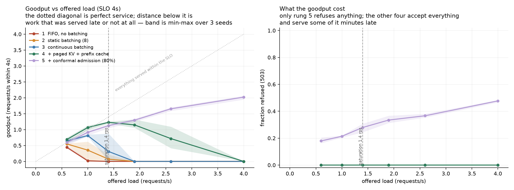

The right-hand panel is there so the left one cannot be read as a free lunch.
Rung 5 buys its goodput by refusing between 18% and 48% of arrivals; the price
is on the chart next to the benefit. And the left panel contains the whole
argument for measuring goodput rather than throughput: at 4 rps rung 4
*completes* nearly every request it is given, eventually. Its goodput is
zero.

### Rung 5 is a choice, so here are three of them

Alpha is not a hyperparameter to be tuned until the numbers look good. It is
the strength of the promise the controller makes about each request it admits,
and choosing it is a product decision, not a fitting decision. Reporting one
alpha would present a choice as a result.

<!-- ARMS -->

| Config | 0.6 rps | 1 rps | 1.4 rps | 1.9 rps | 2.6 rps | 4 rps |
|:--|--:|--:|--:|--:|--:|--:|
| **Goodput (rps within 4s)** | | | | | | |
| 4  + paged KV + prefix cache | 0.69 | 1.07 | 1.23 | 1.15 | 0.72 | 0.00 |
| 5  + conformal admission (99%) | 0.00 | 0.00 | 0.00 | 0.00 | 0.00 | 0.00 |
| 5  + conformal admission (95%) | 0.37 | 0.62 | 0.77 | 0.93 | 1.20 | 1.62 |
| 5  + conformal admission (80%) | 0.59 | 0.91 | 1.13 | 1.30 | 1.65 | 2.02 |
| **p99 end-to-end (s)** | | | | | | |
| 4  + paged KV + prefix cache | 5.4 | 8.3 | 13.7 | 24.9 | 42.3 | 90.0 |
| 5  + conformal admission (99%) | - | - | - | - | - | - |
| 5  + conformal admission (95%) | 1.6 | 1.7 | 1.9 | 1.8 | 2.0 | 2.3 |
| 5  + conformal admission (80%) | 2.8 | 3.4 | 3.2 | 3.6 | 3.8 | 4.7 |
| **Refused (503)** | | | | | | |
| 4  + paged KV + prefix cache | 0% | 0% | 0% | 0% | 0% | 0% |
| 5  + conformal admission (99%) | 100% | 100% | 100% | 100% | 100% | 100% |
| 5  + conformal admission (95%) | 50% | 47% | 51% | 53% | 54% | 59% |
| 5  + conformal admission (80%) | 18% | 21% | 28% | 33% | 37% | 48% |
| **SLO attainment among admitted** | | | | | | |
| 4  + paged KV + prefix cache | 96% | 91% | 79% | 59% | 28% | 0% |
| 5  + conformal admission (99%) | - | - | - | - | - | - |
| 5  + conformal admission (95%) | 100% | 100% | 100% | 100% | 100% | 100% |
| 5  + conformal admission (80%) | 100% | 100% | 100% | 99% | 99% | 97% |

Mean over three seeds. The last block is the promise the controller actually kept: of the requests it chose to admit, how many finished inside 4s. The row above it is what that cost.

<!-- /ARMS -->

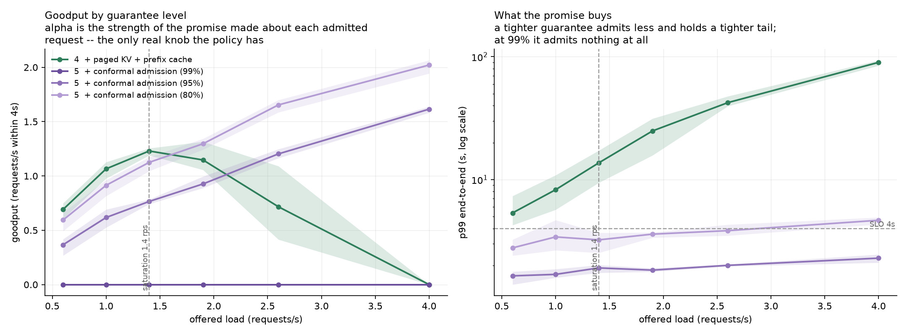

The row with no line on the chart is the most informative one. At
**alpha = 0.01 — a 99% per-request guarantee — the controller refuses 100% of
arrivals at every offered load in the grid, including 0.6 rps with an idle
engine.** That is not a bug, and it is not a tuning failure. The honest upper
bound at the 99th percentile of this workload's latency distribution does not
fit inside a 4 s budget, and a bound that does not fit refuses. Week 4 found
this on a single seed; Week 5 reproduces it on three, at six offered loads,
and it is kept in the results directory rather than tidied away.

It is also the reason the ladder was measured in two blocks — see
[the anchor](#what-two-blocks-cost) below.

The two arms that do serve traffic bracket the trade-off cleanly:

- **alpha = 0.05** keeps p99 end-to-end between **1.6 s and 2.3 s across the
  whole 0.6–4.0 rps grid** and admits every request it can keep the promise
  about: **100% of admitted requests met the 4 s budget at every offered
  load**. It pays for that by refusing about half of them.
- **alpha = 0.20** refuses far less — 18% at 0.6 rps, 48% at 4 rps — and
  delivers **2.02 rps of goodput at 4 rps against rung 4's zero**. Its p99
  reaches 4.7 s at the top of the grid, i.e. it slightly *misses* the SLO
  there, and its attainment among admitted falls to 97%. A weaker promise,
  kept slightly less well, for a third more useful work.

Neither is "the right answer". Which one is right depends on whether the
service would rather refuse a request or serve it late, and that is not a
question a benchmark can answer.

### The spread

A single run of a latency benchmark on a laptop is not a number anyone should
trust. Every cell below is the mean of three seeds with the range beside it.

<!-- SPREAD -->

| Config | offered (rps) | seeds | goodput (rps) | p99 E2E (s) | p99 TTFT (s) | SLO attainment |
|:--|--:|--:|:--|:--|:--|:--|
| 1  FIFO, no batching | 0.6 | 3 | 0.44 [0.40, 0.51] | 8.3 [5.6, 9.6] | 7.44 [5.23, 9.37] | 0.62 [0.52, 0.82] |
| 1  FIFO, no batching | 1 | 3 | 0.02 [0.00, 0.05] | 45.8 [15.2, 73.3] | 45.13 [14.96, 72.74] | 0.02 [0.00, 0.05] |
| 1  FIFO, no batching | 1.4 | 3 | 0.00 [0.00, 0.00] | 121.8 [69.0, 152.4] | 121.03 [68.58, 151.72] | 0.00 [0.00, 0.00] |
| 1  FIFO, no batching | 1.9 | 3 | 0.00 [0.00, 0.00] | 210.6 [160.4, 239.7] | 210.18 [160.04, 239.04] | 0.00 [0.00, 0.00] |
| 1  FIFO, no batching | 2.6 | 3 | 0.00 [0.00, 0.00] | 300.1 [298.1, 301.4] | 299.25 [297.92, 299.95] | 0.00 [0.00, 0.00] |
| 1  FIFO, no batching | 4 | 3 | 0.00 [0.00, 0.00] | 302.1 [301.6, 303.2] | 299.99 [299.98, 300.00] | 0.00 [0.00, 0.00] |
| 2  static batching (8) | 0.6 | 3 | 0.55 [0.54, 0.56] | 7.0 [4.7, 9.0] | 5.04 [3.53, 7.12] | 0.77 [0.68, 0.91] |
| 2  static batching (8) | 1 | 3 | 0.35 [0.00, 0.62] | 12.9 [8.1, 18.9] | 9.72 [5.67, 13.16] | 0.32 [0.00, 0.61] |
| 2  static batching (8) | 1.4 | 3 | 0.07 [0.00, 0.21] | 43.4 [14.7, 63.1] | 40.74 [12.61, 60.16] | 0.05 [0.00, 0.15] |
| 2  static batching (8) | 1.9 | 3 | 0.00 [0.00, 0.00] | 112.0 [77.3, 138.1] | 108.26 [71.57, 134.74] | 0.00 [0.00, 0.00] |
| 2  static batching (8) | 2.6 | 3 | 0.00 [0.00, 0.00] | 217.8 [186.6, 234.8] | 215.74 [184.63, 232.84] | 0.00 [0.00, 0.00] |
| 2  static batching (8) | 4 | 3 | 0.00 [0.00, 0.00] | 300.8 [300.4, 301.0] | 297.15 [293.42, 299.03] | 0.00 [0.00, 0.00] |
| 3  continuous batching | 0.6 | 3 | 0.64 [0.56, 0.71] | 6.3 [4.4, 8.2] | 0.81 [0.72, 0.90] | 0.89 [0.87, 0.91] |
| 3  continuous batching | 1 | 3 | 0.81 [0.78, 0.84] | 13.9 [11.0, 15.9] | 1.41 [1.05, 1.83] | 0.70 [0.63, 0.82] |
| 3  continuous batching | 1.4 | 3 | 0.31 [0.02, 0.87] | 44.0 [19.2, 67.3] | 12.36 [2.43, 18.52] | 0.22 [0.01, 0.63] |
| 3  continuous batching | 1.9 | 3 | 0.00 [0.00, 0.00] | 96.7 [68.7, 113.3] | 68.91 [42.24, 85.00] | 0.00 [0.00, 0.00] |
| 3  continuous batching | 2.6 | 3 | 0.00 [0.00, 0.00] | 187.1 [169.6, 196.4] | 167.51 [145.91, 178.93] | 0.00 [0.00, 0.00] |
| 3  continuous batching | 4 | 3 | 0.00 [0.00, 0.00] | 317.9 [312.8, 325.1] | 299.81 [299.69, 299.87] | 0.00 [0.00, 0.00] |
| 4  + paged KV + prefix cache | 0.6 | 3 | 0.69 [0.60, 0.75] | 5.4 [4.3, 7.4] | 0.58 [0.57, 0.58] | 0.96 [0.95, 0.98] |
| 4  + paged KV + prefix cache | 1 | 3 | 1.07 [0.98, 1.13] | 8.3 [5.7, 10.9] | 0.78 [0.68, 0.84] | 0.91 [0.88, 0.95] |
| 4  + paged KV + prefix cache | 1.4 | 3 | 1.23 [1.19, 1.25] | 13.7 [9.4, 17.2] | 0.85 [0.81, 0.91] | 0.79 [0.71, 0.90] |
| 4  + paged KV + prefix cache | 1.9 | 3 | 1.15 [1.06, 1.32] | 24.9 [15.8, 31.4] | 1.42 [1.34, 1.57] | 0.59 [0.51, 0.72] |
| 4  + paged KV + prefix cache | 2.6 | 3 | 0.72 [0.41, 1.09] | 42.3 [39.6, 47.7] | 5.68 [4.81, 6.33] | 0.28 [0.15, 0.44] |
| 4  + paged KV + prefix cache | 4 | 3 | 0.00 [0.00, 0.00] | 90.0 [84.7, 93.6] | 71.39 [63.90, 77.58] | 0.00 [0.00, 0.00] |
| 5  + conformal admission (80%) | 0.6 | 3 | 0.59 [0.49, 0.66] | 2.8 [2.4, 3.2] | 0.51 [0.45, 0.60] | 0.82 [0.80, 0.84] |
| 5  + conformal admission (80%) | 1 | 3 | 0.91 [0.82, 0.96] | 3.4 [2.7, 4.7] | 0.64 [0.58, 0.74] | 0.78 [0.77, 0.80] |
| 5  + conformal admission (80%) | 1.4 | 3 | 1.13 [1.05, 1.17] | 3.2 [2.5, 3.7] | 0.58 [0.55, 0.61] | 0.72 [0.69, 0.76] |
| 5  + conformal admission (80%) | 1.9 | 3 | 1.30 [1.24, 1.34] | 3.6 [3.4, 3.7] | 0.61 [0.54, 0.67] | 0.66 [0.63, 0.68] |
| 5  + conformal admission (80%) | 2.6 | 3 | 1.65 [1.59, 1.70] | 3.8 [3.5, 4.3] | 0.70 [0.60, 0.76] | 0.63 [0.62, 0.63] |
| 5  + conformal admission (80%) | 4 | 3 | 2.02 [1.94, 2.07] | 4.7 [4.3, 4.9] | 0.81 [0.70, 0.88] | 0.51 [0.50, 0.52] |
| 5  + conformal admission (95%) | 0.6 | 3 | 0.37 [0.27, 0.42] | 1.6 [1.4, 1.8] | 0.40 [0.39, 0.42] | 0.50 [0.43, 0.55] |
| 5  + conformal admission (95%) | 1 | 3 | 0.62 [0.53, 0.69] | 1.7 [1.6, 1.9] | 0.43 [0.40, 0.46] | 0.53 [0.51, 0.56] |
| 5  + conformal admission (95%) | 1.4 | 3 | 0.77 [0.74, 0.78] | 1.9 [1.7, 2.0] | 0.45 [0.43, 0.48] | 0.49 [0.47, 0.54] |
| 5  + conformal admission (95%) | 1.9 | 3 | 0.93 [0.89, 1.00] | 1.8 [1.8, 1.9] | 0.49 [0.45, 0.54] | 0.47 [0.43, 0.50] |
| 5  + conformal admission (95%) | 2.6 | 3 | 1.20 [1.16, 1.25] | 2.0 [2.0, 2.0] | 0.51 [0.43, 0.63] | 0.46 [0.43, 0.47] |
| 5  + conformal admission (95%) | 4 | 3 | 1.62 [1.58, 1.64] | 2.3 [2.1, 2.5] | 0.65 [0.63, 0.67] | 0.41 [0.39, 0.42] |
| 5  + conformal admission (99%) | 0.6 | 3 | 0.00 [0.00, 0.00] | nan [nan, nan] | nan [nan, nan] | 0.00 [0.00, 0.00] |
| 5  + conformal admission (99%) | 1 | 3 | 0.00 [0.00, 0.00] | nan [nan, nan] | nan [nan, nan] | 0.00 [0.00, 0.00] |
| 5  + conformal admission (99%) | 1.4 | 3 | 0.00 [0.00, 0.00] | nan [nan, nan] | nan [nan, nan] | 0.00 [0.00, 0.00] |
| 5  + conformal admission (99%) | 1.9 | 3 | 0.00 [0.00, 0.00] | nan [nan, nan] | nan [nan, nan] | 0.00 [0.00, 0.00] |
| 5  + conformal admission (99%) | 2.6 | 3 | 0.00 [0.00, 0.00] | nan [nan, nan] | nan [nan, nan] | 0.00 [0.00, 0.00] |
| 5  + conformal admission (99%) | 4 | 3 | 0.00 [0.00, 0.00] | nan [nan, nan] | nan [nan, nan] | 0.00 [0.00, 0.00] |

Mean over seeds, with `[min, max]` beside it. Goodput and SLO attainment are computed at a 4s target; latency quantiles come from the load generator's raw records, never from a Prometheus histogram.

<!-- /SPREAD -->

### What each rung cost

A ladder in which every rung improves every metric is not a ladder, it is a
sales deck. This table is generated by `bench/w5_report.py` rather than
written, so the rule cannot be quietly dropped from a later revision of the
writeup: it reports every place a component made a metric more than 5% worse
than the rung below it.

<!-- TRADEOFFS -->

| Change | Metric | worst at (rps) | before | after | | loads affected |
|:--|:--|--:|--:|--:|--:|--:|
| 1  FIFO, no batching → 2  static batching (8) | p99 inter-token | 2.6 | 0.015 | 0.050 | +225% | 6/6 |
| 2  static batching (8) → 3  continuous batching | p99 inter-token | 0.6 | 0.028 | 0.311 | +1030% | 6/6 |
| 2  static batching (8) → 3  continuous batching | p99 end-to-end | 1 | 12.90 | 13.94 | +8% | 2/6 |
| 4  + paged KV + prefix cache → 5  + conformal admission (80%) | completed requests/s | 4 | 3.98 | 2.08 | -48% | 6/6 |
| 4  + paged KV + prefix cache → 5  + conformal admission (80%) | SLO attainment | 0.6 | 0.96 | 0.82 | -14% | 3/6 |
| 4  + paged KV + prefix cache → 5  + conformal admission (80%) | goodput | 1 | 1.07 | 0.91 | -14% | 3/6 |
| 5  + conformal admission (80%) → 5  + conformal admission (95%) | SLO attainment | 0.6 | 0.82 | 0.50 | -39% | 6/6 |
| 5  + conformal admission (80%) → 5  + conformal admission (95%) | goodput | 0.6 | 0.59 | 0.37 | -38% | 6/6 |
| 5  + conformal admission (80%) → 5  + conformal admission (95%) | completed requests/s | 0.6 | 0.59 | 0.37 | -38% | 6/6 |
| 5  + conformal admission (95%) → 5  + conformal admission (99%) | goodput | 0.6 | 0.37 | 0.00 | -100% | 6/6 |
| 5  + conformal admission (95%) → 5  + conformal admission (99%) | completed requests/s | 0.6 | 0.37 | 0.00 | -100% | 6/6 |
| 5  + conformal admission (95%) → 5  + conformal admission (99%) | SLO attainment | 0.6 | 0.50 | 0.00 | -100% | 6/6 |

Every place where adding a component made a metric more than 5% worse than the rung below it, at a 4s SLO. One row per (transition, metric), shown at the offered load where the degradation was largest, with the number of the grid's 6 loads at which it appeared. Generated by `bench/w5_report.py` and not selected by hand -- the 5% floor is there because three seeds do not separate two rungs below it. The full grid is in `docs/ablation_full.csv`.

<!-- /TRADEOFFS -->

Four of these are worth reading closely.

**Continuous batching makes inter-token latency 10× worse, at every offered
load.** Rung 3 raises p99 ITL from 28 ms to 311 ms. That is not a bug being
confessed; it is what iteration-level scheduling *is*. A sequence that would
have had the machine to itself now shares each forward pass with up to
twenty-three others, and chunked prefill puts other requests' prompt work
between its tokens. The trade is the whole reason rung 3 exists: it buys the
time to *first* token, and the end-to-end latency, with the smoothness of the
stream after it.

**Static batching makes it 3.3× worse before that, for a worse reason.**
Wait-to-fill means a request that arrives just after a wave launches waits for
the next one.

**Rung 5 completes 48% fewer requests than rung 4 at 4 rps** — and that is
the point rather than the cost. It also delivers 2.02 rps of goodput where
rung 4 delivers zero. Throughput and goodput point in opposite directions
under overload, and only one of them is what a user experiences.

**Rung 5 is worse than rung 4 *below* saturation, on three of the six offered
loads.** At 0.6 rps the controller refuses 18% of arrivals that rung 4 would
have served inside the budget, costing 14% of both goodput and SLO
attainment. The bound is conservative by construction — it is an upper bound
on a quantile of a distribution with a long tail — so at low load it refuses
work the system would in fact have completed. Anyone deploying this should
know that admission control is not free below the knee, and the honest
mitigation is to raise alpha or to disable the controller under a load
threshold, neither of which is measured here.

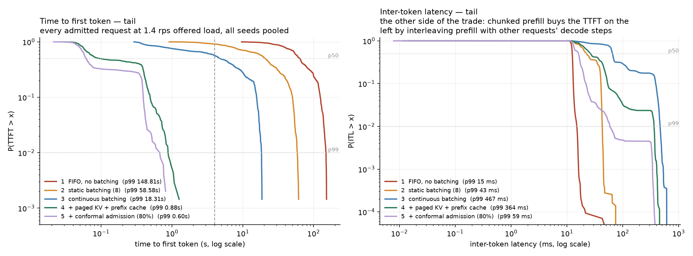

The left panel is where the ladder is legible as *shapes* rather than
quantiles: FIFO's long flat shoulder is head-of-line blocking, and rung 4's
knee two orders of magnitude to the left is the same workload with the same
model on the same machine. The right panel is the bill for it.

### Was the machine the same machine?

A fixed 64-token greedy generation, on an idle engine, timed immediately
before each measured run. This is the substitute for running `powermetrics`
alongside the sweep, which needs root that a reproduction script should not
ask for. It is recorded on every row and reported here; it is never used to
silently drop a run.

<!-- THERMAL -->

| Measured before | probes | decode (tok/s), mean | min | max |
|:--|--:|--:|--:|--:|
| 1  FIFO, no batching | 18 | 87.4 | 83.8 | 94.7 |
| 2  static batching (8) | 18 | 83.9 | 81.4 | 90.4 |
| 3  continuous batching | 18 | 85.7 | 82.7 | 88.3 |
| 4  + paged KV + prefix cache | 36 | 87.6 | 83.6 | 103.9 |
| 5  + conformal admission (80%) | 18 | 88.5 | 81.1 | 94.4 |
| 5  + conformal admission (95%) | 17 | 89.0 | 82.6 | 93.4 |
| **whole sweep** | 125 | **87.1** | 81.1 | 103.9 |

A fixed 64-token single-stream generation, greedy, on an idle engine, timed immediately before each of the 125 measured runs (`bench/run_sweep.py:canary`). It is this project's substitute for `powermetrics`, which needs root: the number is a direct reading of how fast the machine was at that moment.

Across the whole sweep the probe varied by 21.9%. What matters for the ladder is not that spread but whether it fell *unevenly* on the rungs, and the per-rung means differ by 5.7% -- the rate-major, rung-rotated order is what keeps that small, and this table is how the claim is checked rather than asserted.

19 of the 144 probes returned nothing, all of them on the admission rungs (5  + conformal admission (99%): 18, 5  + conformal admission (95%): 1). The probe goes through the same door as every other request, so a controller that is shedding sheds it too. That is a defect in the instrument rather than in the engine -- the probe should bypass admission, and does not -- and it is left as it ran: the rungs whose thermal coverage is thinner are named here rather than quietly averaged in.

<!-- /THERMAL -->

The 21.9% figure is worth sitting with, because it is larger than several of
the differences this project reports elsewhere, and it is exactly the hazard
the build guide warns about for laptop benchmarks. What makes the ladder
survive it is that the variation did not fall unevenly on the rungs: the
per-rung means differ by 5.7%, against rung-to-rung differences of 30% to
two orders of magnitude. That is what the rate-major, rung-rotated order is
for, and this is the table that checks it rather than the paragraph that
promises it.

### What two blocks cost

<!-- ANCHOR -->

| offered (rps) | metric | block 1 (rungs 1-5, alpha 0.01) | block 2 (rung 5 arms) | |
|--:|:--|--:|--:|--:|
| 0.6 | p99 end-to-end (s) | 5.4 | 5.3 | -0% |
| 1 | p99 end-to-end (s) | 8.3 | 8.8 | +7% |
| 1.4 | p99 end-to-end (s) | 13.7 | 14.3 | +4% |
| 1.9 | p99 end-to-end (s) | 24.9 | 27.5 | +11% |
| 2.6 | p99 end-to-end (s) | 42.3 | 38.3 | -9% |
| 4 | p99 end-to-end (s) | 90.0 | 95.6 | +6% |
| 0.6 | goodput (rps) | 0.69 | 0.69 | +0% |
| 1 | goodput (rps) | 1.07 | 1.07 | +0% |
| 1.4 | goodput (rps) | 1.23 | 1.22 | -1% |
| 1.9 | goodput (rps) | 1.15 | 1.11 | -3% |
| 2.6 | goodput (rps) | 0.72 | 1.00 | +40% |
| 4 | goodput (rps) | 0.00 | 0.00 | both zero |

Rung 4, run twice: once interleaved with rungs 1-3, once interleaved with the rung-5 arms hours later, with everything else identical. The largest disagreement is 11% in p99 end-to-end and 40% in goodput.

The goodput figure is the one to take seriously, and it is worse than it looks at first: the large disagreements are at the offered loads just past the collapse point, where goodput is falling steeply and a few percent of extra machine speed moves a lot of requests across the SLO line. That is not noise in the measurement so much as genuine sensitivity in the thing being measured, and it is why the ladder's claims are made about the shape of these curves rather than about individual cells.

Any cross-block comparison -- which means every comparison involving rung 5 -- should be read with this as its floor. The rung-5 differences are one to two orders of magnitude, so they survive it comfortably; a 10% difference between two rungs measured in different blocks would not be a result.

<!-- /ANCHOR -->

### And across sessions

<!-- SESSION -->

| offered (rps) | Week 2 p99 E2E (s) | Week 5 p99 E2E (s) | |
|--:|--:|--:|--:|
| 0.6 | 4.38 | 5.36 | +22% |
| 1 | 8.31 | 8.27 | -0% |
| 1.4 | 14.41 | 13.67 | -5% |
| 1.9 | 27.21 | 24.89 | -9% |
| 2.6 | 32.59 | 42.32 | +30% |

The one rung both sessions ran, at the offered loads they share. Week 2 is a single seed and Week 5 is the mean of three, so this is not a controlled comparison -- it is a bound on how much a cross-session comparison in this writeup can be trusted.

<!-- /SESSION -->

### The drain, measured

<!-- DRAIN -->

| What SIGTERM did | Measured |
|:--|:--|
| `/ready` before the signal | 200 |
| `/ready` after the signal | 503 after 2 ms |
| a request arriving mid-drain | 503 with `Retry-After: 1.000` |
| streams in flight when it landed | 8 |
| of those, still running at the signal | 8 |
| of those, finished with a real `finish_reason` | 8 |
| truncated | 0 |
| wall time from signal to exit | 2.29s |

One run of `uv run bench/demo_drain.py`, which exits non-zero if any row above comes out wrong -- including if every stream had already finished when the signal landed, since that would mean nothing was drained.

<!-- /DRAIN -->

### The CI load gate

Every pull request runs a 90-second open-loop load test against a committed
budget, and fails if p99 regresses by more than 15% or goodput falls below 90%
of the baseline.

**It is not a benchmark, and the distinction is what makes it work.** A GitHub
runner is a shared, oversubscribed VM whose neighbours are invisible; latency
measured on it is a measurement of the runner's mood. Every number elsewhere
in this README comes from a pinned machine and none of them come from CI.

What the gate measures instead is the *scheduler's decisions*. The mock
backend's per-token cost is a fixed sleep, so at a given offered load the same
arrivals produce the same batching decisions, the same preemptions and the
same admission decisions on any machine. A change in that p99 is a change in
behaviour, which is what a gate should fire on.

Three things follow from taking that seriously:

**The gate runs the whole stack, including admission control — which needed
its own predictor.** A split-conformal bound is valid on data exchangeable
with its calibration set and on nothing else. Pointed at the mock backend,
whose requests are several times faster than llama.cpp's, the committed
`models/admission.pkl` predicts multi-second latencies for sub-second work and
refuses 100% of requests at zero load. So the mock backend has its own
calibration, `models/admission-ci-mock.pkl`, collected and fitted by the same
pipeline (`bash bench/ci_baseline.sh`; 5 102 trace rows, four rotated rounds,
held-out coverage 0.967 at alpha = 0.01). Every artifact now records the
backend it was calibrated on, and the gateway compares that against the
running configuration at start-up:

```
warning: admission model was calibrated on backend 'llamacpp' and is being
served on 'mock'. A conformal bound is only valid on data exchangeable with
its calibration set; on a different backend it is not conservative, it is
arbitrary, and the usual symptom is that every request is shed at zero load.
```

**The gate distinguishes "worse" from "unmeasurable".** Exit 1 is a
regression. Exit 2 is an invalid run — too few arrivals for a p99 to mean
anything, nothing completed, a rate missing, or a load generator that fell
more than 250 ms behind its own schedule, which means the run was closed-loop
and its tail is not comparable to anything. A gate that reports "pass" on a
run that did not happen is worse than no gate. An improvement never fails.

The check is on `sched_delay` and deliberately **not** on the arrival
process's KS statistic. The KS test compares *intended* inter-arrival times
against Exp(rate), and those come out of the RNG before any I/O happens: they
are identical whether the runner is idle or on fire. What a starved runner
delays is the send. Gating on the KS p-value would also be selection on a
statistic this project reports honestly — seed 0's realisation sits at the
2.5th percentile of the null distribution, which `bench/validate_loadgen.py`
establishes over 200 seeds.

**The gate has been shown to fail.** `prove-the-gate-can-fail` runs on demand
and on `master`: it sets `max_batch=1`, turning continuous batching into a
queue, and asserts that the check returns exactly 1. A gate nobody has ever
seen go red is a gate nobody knows is wired up. Measured locally, a repeat of
the clean run reproduces to within 5% and the regressed scheduler fails all
six gated metrics:

| rate | metric | baseline | regressed | |
|---:|:--|---:|---:|---:|
| 4 | p99 E2E | 1.009 | 4.283 | +325% |
| 4 | p99 TTFT | 0.231 | 3.881 | +1583% |
| 4 | goodput | 4.279 | 1.919 | −55% |
| 8 | p99 E2E | 1.423 | 43.400 | +2950% |
| 8 | p99 TTFT | 0.344 | 43.263 | +12470% |
| 8 | goodput | 6.138 | 0.000 | −100% |

One honest caveat, marked in the baseline file itself: the committed
thresholds were measured on the author's laptop, not on a runner. The mock
backend's *sleeps* are hardware-independent, which is what makes the gate
portable, but the Python around them — the scheduler's bookkeeping, the KV
accounting, JSON, asyncio — is not. A `refresh the baseline` workflow measures
the identical sweep on `ubuntu-latest` and uploads the result to be committed;
until that has run, the thresholds are a threshold on the difference between
two computers.

### Deployment

```bash
docker compose -f deploy/docker-compose.yml up --build   # gateway + Prometheus + Grafana
fly deploy --config deploy/fly.toml --dockerfile deploy/Dockerfile
```

Full notes in [`deploy/README.md`](deploy/README.md). The parts that are
decisions rather than boilerplate:

**Readiness is not liveness.** `/health` answers "is this process alive" and
keeps answering 200 while draining — a supervisor that restarts a process for
being mid-drain is fighting the drain. `/ready` answers "should traffic be
sent here", which is false both before the model has loaded and after SIGTERM,
and it is what the load balancer polls. Collapsing the two is the most common
way a rolling restart becomes an SLO violation.

**The drain is ordered for the operator.** uvicorn's own SIGTERM handling
already waits for in-flight requests, but it tells nobody: `/ready` would keep
answering 200 until the socket closed, so a balancer on a 10-second interval
keeps routing into a process that is leaving. Cadence flips the flag in the
signal handler first, then lets the running batch finish streaming. Truncating
those streams at shutdown would put a burst of half-written responses into
exactly the tail this project claims to control.

That is a test, not a claim. `bench/demo_drain.py` fails if `/ready` does not
go 503 within a second of the signal, if a late arrival is not refused with a
`Retry-After`, if any in-flight stream is truncated — or if every stream
happened to finish before the signal landed, which would mean nothing was
drained and the demo proved nothing.

The run it produced is [above](#the-drain-measured).

**The weights are baked in and checksummed.** A model pulled on boot is a cold
start that scales with the network, and a cold start is a latency outlier in
the tail this project is about. `resolve/main` without a checksum is
reproducible in name only: a silently requantised model would surface as an
unexplained shift in every latency number the deployment reports.

**The concurrency cap is a memory bound, not backpressure.** Every accepted
request holds a tokenised prompt and a queue entry before it holds any KV, so
a large enough burst could exhaust memory while the scheduler is perfectly
healthy — and an OOM kill invalidates every SLO claim here. It is counted as
`cadence_shed_total{reason="capacity"}`, separately from the conformal sheds,
so an operational refusal can never quietly dilute a coverage number. It is
set far above anything the scheduler will admit; if it is what is shedding,
something upstream has already failed.

**Admission control is off on the deployed instance, and that is the honest
setting rather than a missing feature.** The committed predictor was
calibrated on llama.cpp with Metal. On four shared vCPUs it is not a
conservative bound but an arbitrary one, and it would shed essentially
everything while looking exactly like correct overload behaviour.
`deploy/README.md` has the four-command procedure for calibrating it on the
machine it will actually run on.

---

## What is in the box

### The scheduler (`src/cadence/engine/scheduler/continuous.py`)

Every step is a decision. `_schedule()` is a pure function of scheduler state —
it allocates but never runs the model, which is what makes it testable alone.
It picks a prefill set and a decode set subject to three simultaneous limits:
free KV blocks, free backend sequence ids, and a per-step prefill token budget.

**Chunked prefill.** A 2 000-token prompt prefilled in one shot stalls every
decoding sequence for the length of that forward pass and shows up as a spike
in p99 ITL. Prefill is split into chunks of `max_prefill_tokens` and
interleaved with decode steps. A sequence part-way through its prompt is never
also placed in the decode set — feeding it a decode token would repeat a
position the KV cache already holds, and llama.cpp rejects the batch outright.

**Prefill/decode ordering** is a knob (`prefill_priority`), not a guess:
prioritising prefill costs ITL, prioritising decode costs TTFT, and both
settings are measured.

**Earliest-deadline-first** ordering of the wait queue, because `deadline` and
`slack` are two lines now and are exactly what Week 4's controller will reuse.

### Paged KV (`src/cadence/engine/kv/block_manager.py`)

Fixed 16-token blocks, a LIFO free list (recently freed blocks are the warm
ones), reference-counted sharing, and copy-on-write when a shared partially
filled block is about to be appended to.

Copy-on-write is where paged caches actually break, and the failure is silent:
one user's tokens appear in another user's stream. There is a test for exactly
that, against the real model — two requests with an identical long system
prompt and different user turns, asserted to produce byte-identical output to
running each alone.

The contiguous allocator it replaces is kept (`ContiguousBlockManager`) so the
ablation compares reservation *policies* rather than two different codebases:
paged reserves for the request's own budget and grows a block at a time;
contiguous reserves a slab sized for the server-wide output cap, wasting the
difference on every request that stops early.

### Radix prefix cache (`src/cadence/engine/kv/radix_cache.py`)

A radix tree over token runs. Matching walks the tree; a prompt that diverges
part-way through an edge splits that node so the shared head becomes reusable
by both. Three rules keep it correct, and each has a test:

1. **Match only at block boundaries.** A partially filled block cannot be
   shared — whichever sequence continues first writes its tail.
2. **Reference-count nodes, not just blocks.** A node with `refs > 0` is never
   evicted, or a running sequence loses its history mid-generation.
3. **Evict unreferenced leaves only, LRU.** Evicting an interior node orphans
   its children.

A fourth rule is specific to running on llama.cpp: blocks are an accounting
model, but the physical KV lives in a llama.cpp *sequence*. Every node names an
`owner_seq` whose KV holds exactly the tokens on its root path, a hit is
materialised with `llama_memory_seq_cp` (which adds the new sequence to the
existing cells rather than copying them), and owner sequences are
reference-counted and returned to the pool only when the last node naming them
is evicted. Sequence-id conservation is asserted in the test suite.

Hit rate is reported **token-level**, not request-level, because partial hits
are the normal case and a request-level rate would hide most of what the cache
does.

### The C++17 KV core (`src/cpp/`)

Two headers and a bindings file: `BlockAllocator` (a LIFO free-list stack, a
flat refcount vector, O(1) allocate/share/release/copy-on-write) and
`RadixCache` (block-keyed children, owner sequences, LRU eviction over
unreferenced leaves on a logical clock). Built on install by scikit-build-core;
selected by `CADENCE_KV_CORE`; held to the Python reference by
`tests/test_kv_parity.py`.

Three binding decisions carry the drop-in contract. Block tables stay Python
lists and are mutated in place, because the operations only ever read the
length and one element — converting the table on every decode step would cost
O(len) to save nothing. `OutOfBlocks` is translated back into the *Python*
exception class, because the scheduler catches it by identity and a same-named
C++ exception would sail through `except OutOfBlocks` and kill the engine
thread. And the GIL is held for the whole of every call, which is what makes
each operation atomic against the `/stats` reader on the API thread.

What it was worth is measured in [Week 3](#week-3-the-c17-core-and-what-it-was-actually-worth).

### The model runner (`src/cadence/engine/backends/`)

`ModelRunner` exposes step-level decoding: `decode_step` takes a list of
sequences and advances each by exactly one token. A backend that only offers
"generate until done for one prompt" makes continuous batching impossible — you
end up building static batching with extra steps.

The llama.cpp backend drives `llama_decode` directly with a hand-built
`llama_batch`, so it controls per-token positions, per-token sequence ids and
which rows produce logits. The context is created with `kv_unified = True`, so
`n_ctx` is one shared pool of 16 384 cells competed for by every request in
flight — which makes the block manager an honest model of the real resource
rather than a simulation next to it.

A deterministic `MockRunner` mirrors the same interface with an explicit cost
model. It produces no number in this README; it exists so that the scheduler,
the KV bookkeeping, the streaming path and the load generator are all enforced
in CI without a 500 MB GGUF or a GPU.

### Admission control (`src/cadence/admission/`)

Six small modules, one job each, split along the line that matters: what is
knowable at admission (`features.py`), what predicts latency from it
(`predictor.py`), what turns a prediction into a guarantee (`conformal.py`),
what turns a guarantee into a decision (`conformal_controller.py`), what that
model looks like on disk (`artifact.py`), and how the training set was recorded
in the first place (`trace.py`).

The two seams worth pointing at:

**`extract(ctx, snap)` takes an `AdmitContext` and a `Snapshot`, and nothing
else.** Neither can reach the `Request`, which is where every after-the-fact
field lives, so the leak that would invalidate the whole week is a type error
rather than a code-review question.

**`SplitConformalUpperBound.calibrate_scores` is separate from `calibrate`.**
The offline path has features and outcomes; the online path already has the
score, because the controller kept the bound each admitted request was admitted
on. Keeping them separate is what lets the rolling and adaptive modes recalibrate
on the response path without running the model a second time per request.

The controller's cost on the request path is a histogram
(`cadence_admission_decision_seconds`) rather than an assumption: feature
extraction plus two gradient-boosted quantile predictions measure p50 0.35 ms,
p99 0.42 ms on this machine.

### Observability (`src/cadence/obs/`)

Prometheus histograms with buckets **dense around the SLO** — the default
buckets interpolate a p99 that is wrong by exactly the amount that matters —
plus gauges for queue depth, batch size, free KV blocks and fragmentation
ratio, and counters for preemptions, copy-on-write, shed reasons and
token-level prefix hits. OpenTelemetry spans per phase (queue → prefill →
decode), off by default because the exporter's own overhead is visible in ITL
at this scale.

The Grafana dashboard is **generated** by `deploy/grafana/make_dashboard.py`,
which validates every PromQL query against the collectors actually registered
in `cadence.obs.metrics`. A renamed metric fails CI instead of silently
emptying a panel three weeks later.

---

## Tests

```bash
uv run pytest -q -m "not slow"   # no model needed; this is what CI runs
uv run pytest -q -m slow         # against the real GGUF

# the differential fuzz on its own, at the depth main runs it
CADENCE_FUZZ_EXAMPLES=5000 uv run pytest -q tests/test_kv_parity.py \
  --hypothesis-show-statistics
```

The KV tests are parametrised over both implementations of the core, so a
green suite means the C++ extension satisfies the Python reference's own
specification and not merely that the two agree on random inputs.

The tests worth knowing about:

| Test | What it protects |
|---|---|
| `test_backend_equivalence` | Two sequences decoded in one batch produce what they produce decoded apart (≥99% top-token agreement — batching genuinely changes numerics, so bit-exactness is the wrong assertion). Chunked prefill likewise. |
| `test_kv_isolation` | Cross-request contamination, against the real model. Prefix cache on vs off, and paged vs contiguous, must produce identical text. |
| `test_loadgen` | The harness itself: exponential arrivals, latency from intended arrival, arrival rate unaffected by a slow server, warm-up rows flagged rather than dropped. |
| `test_block_manager` | Hypothesis property: a block is on the free list iff its refcount is zero, never twice, and nothing leaks. Plus copy-on-write. **Runs against both the Python reference and the C++ core.** |
| `test_radix_cache` | Block-boundary truncation, referenced nodes never evicted, LRU over leaves, owner-sequence release, no block leak over insert/evict cycles. **Runs against both implementations.** |
| `test_kv_parity` | The differential fuzz: random operation sequences driven through the Python reference and the C++17 core in lockstep, comparing every observable — including block ids — after every step. 600 sequences per PR, 5 000 on `main`, with the coverage each sequence reached reported rather than assumed. |
| `test_scheduler` | A late arrival joins the running batch (and, under static batching, provably cannot). KV blocks and sequence ids return to baseline after a run and after a mid-stream client disconnect. A prefix matched during admission is not evicted out from under the admission decision — the Week 3 crash, with both failure modes covered. `CADENCE_KV_CORE=auto` degrades to the Python reference when the extension is missing, and an explicit `cpp` refuses to. |
| `test_api_sse` | An unmodified `openai` Python client streams against the server. Concurrent streams carry only their own tokens. Dashboard queries reference metrics that exist. |
| `test_conformal` | The guarantee itself, including with a *deliberately useless* predictor — if coverage depended on the model being good, the method would be a heuristic with a proof attached. The finite-sample correction, the `n >= 100` arithmetic behind it, the Monte-Carlo marginal-coverage check over 4 000 fresh calibration sets, and the two ways the guarantee is lost and recovered: a distribution shift drops static coverage to 4%, ACI holds 90.0% against a 90% target on the same stream. |
| `test_admission` | That the feature extractor *structurally cannot* see the outcome — the leak that would make every number in Week 4 meaningless. Then the policy: the bound is conditional and not constant, hysteresis stops the shed/admit loop chattering, the queue cap still overrides the model, `Retry-After` is derived from work in flight, a client timeout is treated as censored rather than as an observation. Then the whole path: a gateway with a fitted model refuses with a 503 and a `Retry-After`, and the trace it writes round-trips into a design matrix. |

---

## Negative results and limitations

Reported because a ladder where every rung improves every metric is not
credible.

**1. Continuous batching makes p99 inter-token latency 25× worse.** This is
the largest single regression in the ladder and it is a direct consequence of
the thing that makes rung 3 work. FIFO's p99 ITL is 15 ms and never moves;
continuous batching's is 378 ms at its peak-goodput load. Two causes, both
structural: a decode step now carries a whole batch rather than one sequence,
and prefill chunks are interleaved between decode steps, so a decoding
sequence's next token waits behind somebody else's prompt.

The prefix cache is the evidence for the second cause. Rung 4 does strictly
more work per request than rung 3 in every respect except prefill, and its p99
ITL at 0.3 rps is **57 ms against rung 3's 303 ms** — a 5× improvement bought
by not running prefill at all for cached prompts. The regression is prefill
interference, and the fix for it is to have less prefill to interfere with.

**2. Static batching is worse than no batching at low load.** At 0.3 rps rung 2
has a *higher* p50 end-to-end latency than rung 1 (1.96 s vs 1.72 s) and lower
SLO attainment (0.877 vs 0.895). Wait-to-fill is the cause: a request that
arrives into an empty server waits up to 50 ms for companions that never come.
Rung 2 only starts paying at 0.6 rps, where it overtakes FIFO on goodput by
1.5×. A batching scheme that is unconditionally better than not batching would
be a suspicious result, not a good one.

**3. Throughput does not distinguish the four configurations at all.**
Completed requests per second and output tokens per second are identical across
all four rungs to within 1.5% at every offered load. This is not a measurement
artifact — it is what an open loop with no admission control and a patient
client must produce. Every request eventually completes; the scheduler decides
when. Any comparison of these four systems on throughput would conclude,
correctly and uselessly, that they are the same.

**4. Goodput declines past its own peak, and nothing in Weeks 1–2 stops it.**
Rung 4 peaks at 1.19 rps of goodput at 1.4 rps offered, then falls to 1.16 at
1.9 and 1.01 at 2.6 — it does more work and delivers less of it on time. No
rung holds p99 flat past saturation, because no rung refuses work. Week 4's
controller is what closes this, and rows 7–10 below are what it costs.

**5. The prefix cache's value is entirely contingent on KV headroom, and at the
first sizing it measured nothing.** At 8 192 KV cells the running batch alone
consumed the pool, every admission evicted a cached prefix, and the measured
hit rate was 10% — a number that described the cache's own eviction rate. The
mechanism was correct; the experiment was not. Doubling the pool to 16 384
cells moved the hit rate to 61% and p50 latency at 1.0 rps from 3.95 s to
1.17 s. A cache benchmarked in a configuration where it cannot retain anything
reports a fact about the configuration, not about the cache.

**6. Chunked prefill is the single biggest p99 win in the scheduler — and the
default it shipped with was the wrong size.** The chunk budget was swept at
1.4 rps offered load, on `continuous+cache`, with `n_batch` raised to 2048 for
every arm so that the scheduler's prefill budget is the only thing that varies:

<!-- KNOBS -->

**Chunked prefill** — one run each at 1.4 rps offered load.

| Arm                              |   Goodput |   SLO met |   TTFT p50 |   TTFT p99 |   ITL p50 |   ITL p99 |   E2E p50 |   E2E p99 |
|:---------------------------------|----------:|----------:|-----------:|-----------:|----------:|----------:|----------:|----------:|
| prefill budget 128 tokens        |     1.116 |     0.668 |      0.241 |      1.592 |     0.049 |     0.156 |     2.401 |    17.798 |
| prefill budget 256 tokens        |     0.987 |     0.591 |      0.274 |      2.548 |     0.057 |     0.276 |     3.387 |    26.992 |
| prefill budget 512 tokens        |     0.981 |     0.587 |      0.261 |      1.556 |     0.062 |     0.462 |     3.383 |    27.12  |
| unchunked (budget 2048 > prompt) |     0.981 |     0.587 |      0.36  |      1.113 |     0.049 |     0.503 |     3.249 |    18.543 |

**Prefill/decode order** — one run each at 1.4 rps offered load.

| Arm                   |   Goodput |   SLO met |   TTFT p50 |   TTFT p99 |   ITL p50 |   ITL p99 |   E2E p50 |   E2E p99 |
|:----------------------|----------:|----------:|-----------:|-----------:|----------:|----------:|----------:|----------:|
| prefill before decode |     1.19  |     0.713 |      0.106 |      0.902 |     0.038 |     0.368 |     2.025 |    14.478 |
| decode before prefill |     1.197 |     0.717 |      0.15  |      0.959 |     0.036 |     0.366 |     2.029 |    14.389 |

**Replicates of the unmodified configuration** — identical settings, 3 runs, 1.4 rps offered load. The spread here is the floor any knob difference has to clear.

| Arm         |   Goodput |   SLO met |   TTFT p50 |   TTFT p99 |   ITL p50 |   ITL p99 |   E2E p50 |   E2E p99 |
|:------------|----------:|----------:|-----------:|-----------:|----------:|----------:|----------:|----------:|
| replicate-1 |      1.19 |     0.713 |      0.107 |      0.906 |     0.037 |     0.366 |     2.028 |    14.422 |
| replicate-2 |      1.19 |     0.713 |      0.106 |      0.911 |     0.038 |     0.368 |     2.002 |    14.397 |
| replicate-3 |      1.19 |     0.713 |      0.105 |      0.898 |     0.038 |     0.366 |     2.035 |    14.453 |

<!-- /KNOBS -->

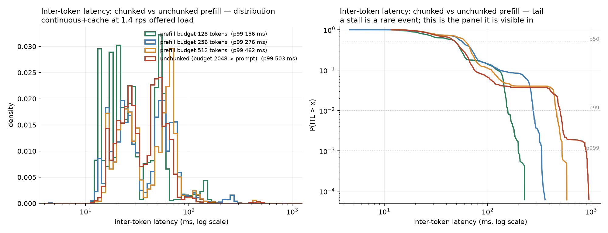

The worst-case stall tracks the budget almost linearly — 128 tokens → 228 ms,
256 → 361 ms, 512 → 585 ms, unchunked → 958 ms — which is the mechanism made
visible: **the longest gap a decoding sequence can see is one prefill chunk's
forward pass.** p99 ITL improves 3.2× from unchunked to a 128-token budget
(503 ms → 156 ms) and p999 improves 4.5× (891 ms → 198 ms).

Three honest qualifications:

* The ladder ran with a 512-token budget, and this sweep says 128 would have
  been better on ITL *and* on goodput (1.116 vs 0.981). That is a tuning result
  found after the ladder rather than folded back into it, and it is reported
  here rather than retrofitted there.
* The first attempt at this experiment measured nothing. With ~540-token
  prompts, a 512-token budget splits a prompt into one full chunk and a
  28-token remainder — comparing that against "unchunked" compares two
  configurations that behave almost identically. The budget had to be swept
  down to where it actually bites.
* Raising `n_batch` from 512 to 2048, which unchunked prefill requires, costs
  about 6% of goodput on its own (1.190 → 1.116 at the best chunk size). Every
  arm above pays it, so the comparison between them is clean, but the absolute
  numbers are not comparable to the ladder's.

**7. The prefill/decode priority knob does nothing measurable here, and the
replicates are what make that statement possible.** Prioritising decode over
prefill costs 42% on p50 TTFT (0.106 s → 0.150 s) and buys nothing on ITL
(p99 0.366 s vs 0.368 s) or goodput (1.197 vs 1.190). Three replicates of the
unmodified configuration agree to within 1.7% on every metric — goodput
identical to three decimal places, p50 TTFT 0.105–0.107 s, p99 ITL
0.366–0.368 s — so the TTFT difference is real and outside the noise while the
ITL difference is not. The knob exists and is worth having; on *this* workload,
where prefill is small relative to decode, prefill-first is simply the right
default and the trade-off curve the guide expects to see is flat.

**8. The C++ port is a 2.1× microbenchmark win and a 0% end-to-end win.** The
profile put the two data structures at 0.02% of scheduler-thread time before
the port started, and the arithmetic — 23–31 µs of bookkeeping against a
measured 70 ms engine step — said the end-to-end delta had to be far smaller
than the 1.7% run-to-run spread. It is: throughput identical to three decimal
places at every rate, and goodput differences that change sign between rates.
The measured speedup is also capped by something other than the algorithm:
nearly all of the C++ `match` call is pybind11 converting the prompt list into
a `std::vector`, and the tree walk is below the noise floor. Reported in full in
[Week 3](#week-3-the-c17-core-and-what-it-was-actually-worth), because a port
justified after the fact by the speedup it did not deliver is the failure mode
this section exists to avoid.

**9. Two of the four correctness bugs found in this project so far were found
by instruments, not by tests.** Hypothesis found the copy-on-write accounting
error in `can_append`; the Week 3 profiling run found the use-after-free in
admission by crashing the engine thread within a minute of being pointed at a
configuration the ladder never reached. Both had been on `main`, both passed
the whole suite. The lesson recorded here is about coverage of *states*, not of
lines: the pressure regime that triggers a bug is a thing a test has to be told
to reach.

**Stated omissions.** Swapping preempted KV to host memory is the standard
alternative to recompute; it trades memory bandwidth for wasted prefill compute
and is not built — recompute is 20 lines and the prompts here are short enough
that it is the right trade. Prefix-cache entries are inserted when a request
*completes*, not when its prefill finishes, so a cold-start burst of
simultaneous identical prompts shares nothing; inserting at prefill completion
would capture that, at the cost of having to invalidate cache entries when a
sequence is preempted.

---

**7. Admission control loses goodput below saturation, and the stronger the
guarantee the more it loses.** At 0.6 rps offered — comfortably inside
capacity — the unmanaged system delivers 0.72 rps within the SLO; the 80%
guarantee delivers 0.61 and the 95% guarantee 0.15. Every one of those refused
requests would probably have been served in time. The controller refuses them
because their *predictive tail* does not fit the budget even when their median
does, which is what a per-request guarantee means on a workload whose requested
output lengths span 16 to 512 tokens. A gateway that ran below saturation all
day would be worse off with this switched on, and the honest statement of the
result is a frontier rather than a number.

**8. The 99% guarantee is unattainable against this SLO, and the controller
says so by refusing everything.** Not a bug and not a tuning failure: the
workload's implied unloaded p95 is 5.0 s against a 4 s budget, so a bound that
must hold for 99% of a request's own distribution has almost nothing it can
admit. It compounds with a second, real feedback loop — the prefix-cache
feature is warmed only by admitted requests, so an arm that admits nothing
keeps the cache cold, which is the state in which the bound is largest. Its
measured prefix hit rate is 0.00 at every offered load while the arms beside it
sit at 0.72–0.80. The fix is a warm-start exploration quota, and it is a
Week 5 item.

**9. Outside the load range the model was fitted on, the bound stops holding —
by a lot.** On the rung-4 arm of the Week 4 sweep, which runs with admission
off, the 99% bound covers 100% of requests at 0.6, 1.0 and 1.9 rps, 47% at
4 rps and 18% at 6 rps. The training set reached 3.4 rps; at 6 rps with nothing
shed the median response takes 110 s, which is past every split point the trees
have. The guarantee is conditional on exchangeability with the calibration
data, this is what that condition failing looks like, and it is only harmless
here because a controller that is switched on never lets the system reach that
state.

**10. The online recalibration modes are built and tested but cannot act on a
three-minute run.** The rolling window holds 512 completions and ACI's step is
0.005 per observation; at the admitted rates measured here, a 180 s run
replaces a fraction of that window and moves the working level by thousandths.
They are the right mechanism for a service that runs for hours, and reporting
them as a result of these runs would be reporting a mechanism that never
engaged.

---

## Roadmap

| Week | Ships | Status |
|---|---|---|
| 0 | Toolchain, repository scaffold | Done |
| 1 | SSE gateway, FIFO baseline, open-loop load generator, metric definitions | Done |
| 2 | Continuous batching, paged KV, radix prefix cache, metrics + tracing stack | Done |
| 3 | Block allocator and radix match in C++17 behind pybind11, fuzz-tested against the Python reference | Done |
| 4 | Latency predictor + split-conformal admission control | Done |
| 5 | Full ablation ladder with seeds, CI load gate, deploy, writeup | Done — five rungs, six offered loads, three seeds, interleaved and thermally probed; four figures; a load gate that has been shown to go red; a deployable image with readiness, drain and a memory bound. See [Week 5](#week-5-the-ladder-three-seeds-and-a-gate-that-can-fail) |

Week 3 began with a profile under load, the profile said the allocator and the
radix match are *not* on the hot path, and that is written down: see
[Week 3](#week-3-the-c17-core-and-what-it-was-actually-worth) for what was
ported anyway and why.

### What is deliberately not here yet

Against the project's own definition of done, these boxes are unticked and it
is worth being explicit about which:

| | |
|---|---|
| One five-rung sweep in a single session | Rungs 1–4 are one interleaved block. Rung 5's usable arms are a *second* block, run hours later, because the first block's rung 5 turned out to be the arm that refuses everything. Rung 4 was run again alongside them as an anchor, so the cost of that is [measured rather than promised](#what-two-blocks-cost). |
| Three seeds per rung | Done. Every cell in the Week 5 tables is the mean of three arrival realisations with the range beside it, and the three seeds' realisations were recorded before the sweep rather than chosen after it. |
| CI load-test regression gate | Done, and demonstrated failing. One caveat is marked in the baseline file itself: the committed thresholds were measured on a laptop rather than on a runner, and the `refresh the baseline` workflow exists to replace them. |
| An end-to-end win from the C++ core | There isn't one, and the arithmetic says there could not be at this model size. The claim the port supports is correctness and a written-down interface, not speed. |
| Live deployment URL | The image, `fly.toml`, the readiness/drain/cap machinery and the deploy runbook are committed, and the drain is asserted by a test on every CI run. The container itself is still unverified end to end — there is no Docker on this machine — so the build is reviewed rather than run, and no number anywhere in this README comes from it. |
| Admission control on the deployed instance | Off, deliberately. The committed predictor was calibrated on Metal and is not a valid bound on a CPU container; the gateway now says so at start-up instead of silently shedding everything. The four-command recalibration procedure is in `deploy/README.md`. |
| A predictor that survives a workload change | The model is fitted on *this* workload and this machine. Nothing here establishes that it transfers to another prompt mix, and the honest mitigation for that is the rolling recalibration in `conformal.py`, which is implemented and unit-tested but is not the mode the headline run used. |

---

## Repository layout

```
src/cadence/
  api/          FastAPI app, OpenAI routes, SSE framing
  engine/
    engine.py           owns backend + scheduler + admission policy
    request.py          lifecycle state machine, cross-thread streaming
    scheduler/          fifo.py, static_batch.py, continuous.py
    kv/                 block_manager.py, radix_cache.py  (Python reference),
                        protocols.py (the interface both cores satisfy),
                        cpp.py (the C++ core, assembled the same way)
    backends/           base.py protocol, llamacpp.py, mock.py
  admission/    features.py     admission-time feature vector, no lookahead
                predictor.py    quantile regression + the two baselines
                conformal.py    split-conformal bound, rolling and adaptive
                conformal_controller.py   the admit/shed policy
                artifact.py     the fitted model on disk
                trace.py        one JSONL row per request: features, outcome
  obs/          Prometheus collectors, OpenTelemetry setup, sampling profiler
  _core.pyi     hand-written stubs for the extension
models/         the GGUF (not committed) and admission.pkl (committed: the
                fitted predictor, its calibration scores and the provenance
                sidecar, 2 MB)
src/cpp/        the C++17 KV core
  include/cadence/    block_allocator.hpp, radix_cache.hpp
  src/bindings.cpp    pybind11 module, built by scikit-build-core on install
bench/          calibrate, validate_loadgen, loadgen, workloads, stub_server,
                run_sweep, run_ladder, run_knobs, merge_rerun, srchash,
                run_ablation.sh, run_week3.sh, run_week4.sh, run_week5.sh,
                report_week5.sh, ci_baseline.sh,
                profile_core, flamegraph, bench_core,
                collect_traces, traces, fit_predictor,
                analyze, charts, w4_charts, w5_charts, make_report,
                knob_report, core_report, w4_report, w5_report, embed_tables,
                check_regression   the CI load gate
                demo_drain         the graceful shutdown, as an assertion
  baselines/    ci_baseline.json   the budget the load gate enforces
deploy/         Dockerfile (three stages: weights, build, runtime), fly.toml,
                entrypoint.sh, docker-compose, Prometheus, OTel collector,
                generated Grafana dashboard, README.md
results/
  calibration.json        machine measurements the sweep grid and SLO were chosen from
  loadgen_validation.json arrival process over 200 seeds
  src.hash                engine source fingerprint (bench/srchash.py), stamped
                          into every run's meta.json from Week 3 on
  w2_ladder/              the four-rung ladder, plus meta.json provenance
  w2_knobs/               chunked-prefill sweep, prefill/decode order, replicates
  w3_profile/             sampling profile of the scheduler thread, per KV core
  w3_bench/               the C++/Python microbenchmark
  w3_ab/                  the end-to-end A/B between the two KV cores
  w4_traces/              the admission training set: one JSONL block per
                          (round, offered load), collected with admission off
  w4_fit/                 the fit: coverage, baselines, safety sweep, and the
                          per-request predictions the coverage figure is drawn
                          from
  w4_admission/           the two-arm overload sweep, and the traces the
                          controller wrote while it was deciding
  w5_ladder/              the five-rung ladder: 90 runs, three seeds, with
                          per-run parts, the thermal probe log and provenance
  w5_ladder_r5/           the rung-5 arms and the rung-4 anchor, 54 runs
  w5_loadgen_seed*.json   the three seeds' arrival realisations, recorded
                          before the sweep rather than after it
  ci_traces/, ci_fit/     the mock backend's own admission calibration, which
                          the CI load gate needs and the laptop's cannot serve
  ci_gate/                the run the committed CI baseline was measured from
  validation/             open-loop generator checked against a model-free stub
docs/           tables and figures, all generated from the parquet above
tests/
```

---

## Contributing and security

Contributions are welcome. Start with [CONTRIBUTING.md](CONTRIBUTING.md), and
use GitHub's private vulnerability reporting rather than a public issue for
security-sensitive findings. Deployment assumptions and reporting guidance
are documented in [SECURITY.md](SECURITY.md).

## Citation

If Cadence or its methodology supports published work, cite the repository
using [CITATION.cff](CITATION.cff).

## License

Cadence is released under the [MIT License](LICENSE). Model weights are not
distributed with the repository and remain subject to their own upstream
licenses.
